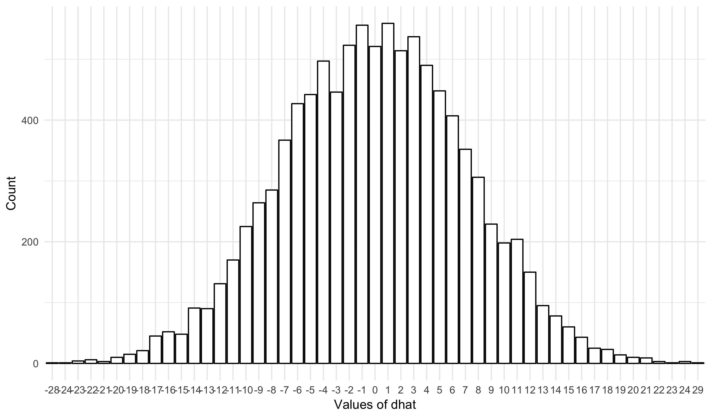
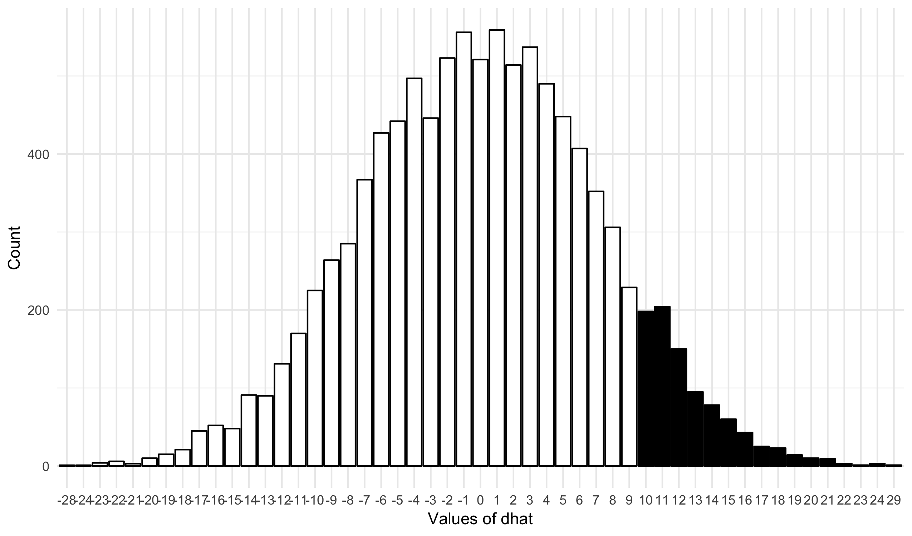
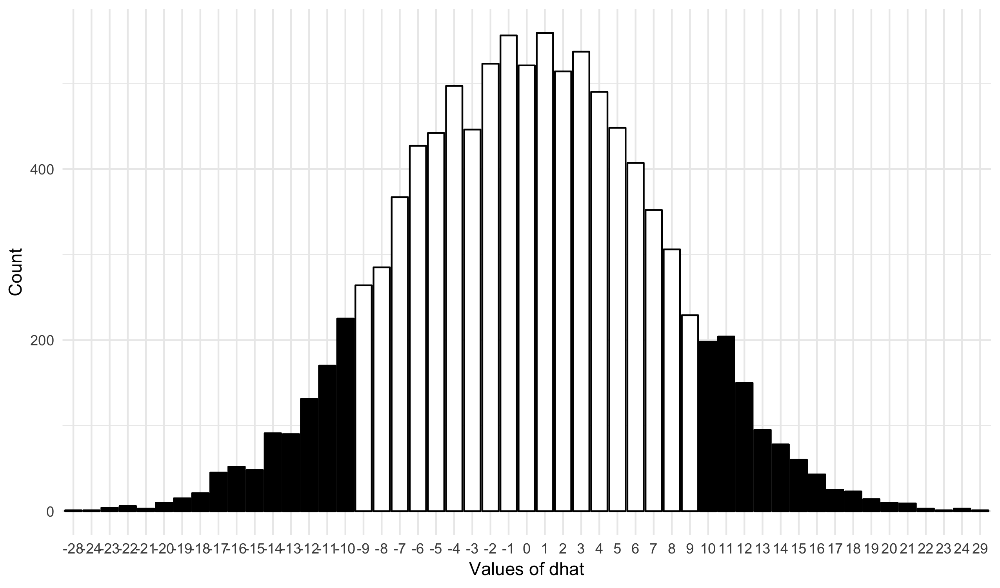

### Learning Objectives

- Understand the role of the **null hypothesis** and **alternative hypothesis**
in inferential statistics.
- Define a **test statistic** and its **sampling distribution** under
the null hypothesis ($$H_{0}$$).
- Describe the \textbf{p-value} in terms of a inferential statistics.
- Understand how simulation can be used to produce a estimation of a sampling
distribution.

### Experiment, again

Last class we walked through an example of statistical inference applied to an
experimental procedure. The research question was to determine whether pea
plants were more likely to survive under white light compared to red LED
lights. Today, we are going to go through this same example, but this time
introducing the formal language of statistical inference.

As a reminder, here is the design of the experiment. We took 100 newly
planted pea plants and place them under a white LED light and took another
100 newly planted pea plants and placed them under
a red LED light. In all other respects the plants were treated the same
(same seed source, same water, same temperature, ect.). After 30 days, we
measured whether a particular plant is still alive.

### Null hypothesis

In the language of statistical inference, we start with a statement known as
the **null hypothesis**. The **null hypothesis** is a statement about an
unknown parameter, usually that there is no relationship between two measured
phenomena, or no association among groups. Typically the null hypothesis is
denoted by $$H_{0}$$. The goal of the experiment is to see if we have strong
evidence to *reject* the null hypothesis.

In our example, the null hypothesis is that there is no difference between the
survival probability of a plant under a white light and a plant under a red
light. Symbolically, we can write this as:

$$ H_{0}: p_W = p_R $$

I like to think of an analogy of a court case to understand the null
hypothesis. You've probably heard to phrase "innocent until proven guilty".
In inference, we assume the null is true until we have strong evidence that it
is not.

### Alternative hypothesis

The **alternative hypothesis** is the thing we want to find whether there is
evidence in support of through our experiment. In general, the alternative
hypothesis is some statement that directly contradicts the null hypothesis.

In our example, the alternative hypothesis is that the probability of
survival under the white light is different than the probability under the
red light. In symbols, we have:

$$ H_{A}: p_W \neq p_R $$

In the court example, the alternative hypothesis is like finding someone
guilty. Do we have evidence that we can *reject* the null hypothesis of
innocence in support of the alternative hypothesis of guilt? Note that failing
to do this does not mean that someone **is** innocent; only that we failed to
find proof that they are guilty. Similarly, inference never proves the
null hypothesis; it just fails to find support for the alternative.

### Test statistic

How do we go about determining whether there is evidence to support the
alternative hypothesis? The first step is to construct a **test statistic**.
A test statistic is a number that summarizes the data in the experiment.

In our example, the observed data looked like this:

<table id="dtable">
<tr>
  <td></td>
  <td>Died (D)</td>
  <td>Survived (S)</td>
</tr>
<tr>
  <td>White light (W)</td>
  <td>40</td>
  <td>60</td>
</tr>
<tr>
  <td>Red light (B)</td>
  <td>50</td>
  <td>50</td>
</tr>
</table>

We summarized the data by first computing the probability of survival under
the two lights:

$$ \widehat{p}_W = \frac{\text{survived white light}}{\text{total white light}} = \frac{60}{60 + 40} = \frac{60}{100} = 0.6 = 60\% $$

$$ \widehat{p}_R = \frac{\text{survived red light}}{\text{total red light}} = \frac{50}{50 + 50} = \frac{50}{100} = 0.5 = 50\% $$

And then producing the test statistic given by:

$$ \widehat{D} = \widehat{p}_W - \widehat{p}_R = 0.6 - 0.5 = 0.1 $$

This one number summarizes the output of the experiment. (Note: Last time I
used the term "summary statistic". A test statistic is a special case of
summary statistic that is used to compute the next two concepts.)

### Sampling distribution

I asked us to consider last time how strong the evidence of observing
$$\widehat{D} = 0.1$$ is in support of the alternative hypothesis (just without
that terminology). To do this, we simulated what the *distribution* of
$$\widehat{D}$$ looks like when the null hypothesis is true. The distribution of
a test statistic under the assumption that the null hypothesis is true is
called the *sampling distribution*.

Here is the code we used last class to simulate the sampling distribution:


N <- 10000
dhat_set <- rep(0, 10000)
for (i in seq_len(N))
{
  white <- sample(c("survived", "died"), size=100, replace=TRUE)
  phat_w <- mean(white == "survived") * 100

  red <- sample(c("survived", "died"), size=100, replace=TRUE)
  phat_r <- mean(red == "survived") * 100

  dhat <- phat_w - phat_r
  dhat_set[i] <- dhat
}


And here is the visualization of the sampling distribution:


## Warning: `data_frame()` is deprecated, use `tibble()`.
## This warning is displayed once per session.


This shows, for each value of the statistic (rounded to a whole percentage
point) how many simulated values showed up in each bucket. Notice that the
distribution is roughly symmetric and centered around zero.

### p-value

How do we use the sampling distribution to see whether there is evidence to
support the null hypothesis? We find the value of the test statistic that we
observed in our experiment and find what proportion of simulated values are
*at least as extreme* as our value. If this proportion is small, there is a
small chance that our data would be observed if the null was in fact true.
This proportion is called the *p-value*; it's a number from 0 to 1, with
smaller values providing stronger evidence that the alternative hypothesis
is preferred in regards to the null hypothesis.

Visually, we can compute the p-value as the proportion of data points in
the black region here:

Which we can find directly in R:


mean(dhat_set >= 10) * 100



## [1] 8.82


Typically, though, we instead want to find the proportion of values on *both*
sides of the distribution. So we have this region instead:

Which we can find using


mean(abs(dhat_set) >= 10) * 100



## [1] 17.58


So, there is relatively weak evidence that the alternative hypothesis should
be preferred to the null hypothesis.

### Statistical significance

A statistical inference test is said to be *statistically significant* if the
p-value is at least as small as some pre-specified cut-off value. When this
occurs we say that "the null hypothesis is *rejected* in favor of the
alternative hypothesis." Otherwise, we say that we "failed to reject the null
hypothesis."

By far the most common cut-off value (called the *critical value*) in the
sciences and social sciences is 0.05. Many statisticians (myself included)
suggest that value of 0.005 is preferable. More on this later. It is also
generally agreed that more attention should be paid to the p-value itself
rather than whether is just below a particular value or not.

In our example, the test is not significant at the 0.05 level. We therefore
fail to reject the null hypothesis based on the experiment.
