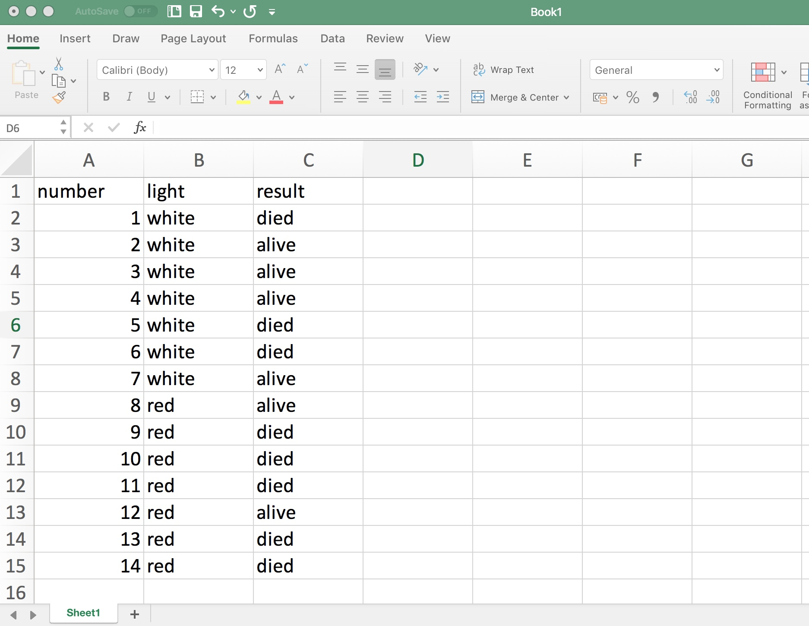
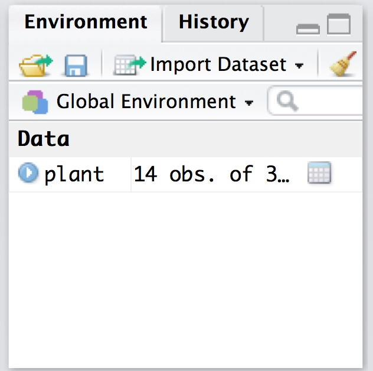
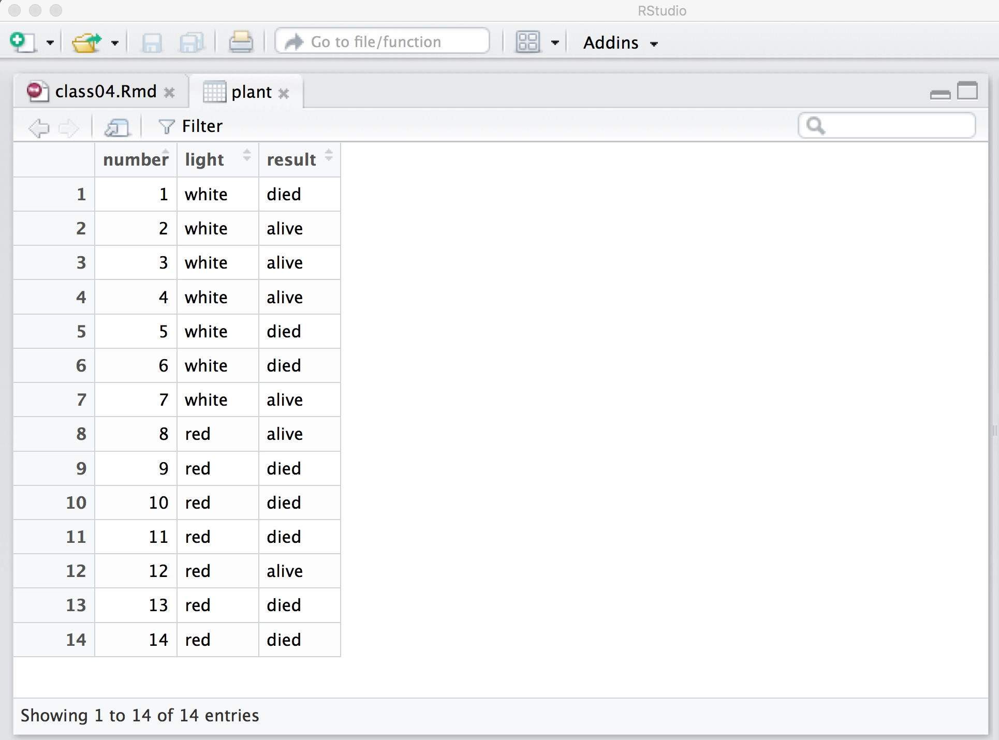

### Learning Objectives

- Organize tabular data using the **unit of observation**.
- Understand the terms **variable**, *observation**, and
**unit of observation** as they pertain to tabular data sets.
- Follow general naming conventions when constructing variable names.
- Produce a tabular dataset and save as a comma separated values (CSV) file.
Memorize code for reading the data into R.

### Collecting and organizing 2x2 contingency experimental data

So far, we have primarily discussed an experimental design in which the goal
is to discern the effect of a two-category independent variable on a
two-category response. A natural way to write the data from such a study,
as we have used, is a 2x2 contingency table:

<table id="dtable">
<tr>
  <td></td>
  <td>Died (D)</td>
  <td>Survived (S)</td>
</tr>
<tr>
  <td>White light (W)</td>
  <td>40</td>
  <td>60</td>
</tr>
<tr>
  <td>Red light (B)</td>
  <td>50</td>
  <td>50</td>
</tr>
</table>

This explains the entire dataset in a compact way using only four numbers,
regardless of how many data points were collected. However, this structure
is not ideal because it does not generalize in any way to more complex
designs and does not let us store any other useful data about the experiment.
Say for example that we latter learn that the automated water drip for a
plant number 7 was not working... if we only store a contingency table, how
would we know how to remove this bad data point from the study?

Let's now describe a different format for organizing data that will serve
our needs for the entire course.

## Tabular data formats

In this course we will store data in a **tabular format. These tables will
have **observations** stored in rows and **variables** stored in columns. The
individual elements are called **values**. So, each row represents a
particular object in our dataset and each column represents some feature of
the objects. The object type that constitutes a row of the data is called a
**unit of observation**.

Let's look at how a few rows of our plant dataset can be stored in such a
format:

<table id="dtable">
<tr>
  <td><b>light</b></td>
  <td><b>result</b></td>
</tr>
<tr>
  <td>White</td>
  <td>Alive</td>
</tr>
<tr>
  <td>White</td>
  <td>Alive</td>
</tr>
<tr>
  <td>Red</td>
  <td>Died</td>
</tr>
<tr>
  <td>Red</td>
  <td>Alive</td>
</tr>
<tr>
  <td>White</td>
  <td>Died</td>
</tr>
<tr>
  <td>White</td>
  <td>Alive</td>
</tr>
<tr>
  <td>Red</td>
  <td>Alive</td>
</tr>
<tr>
  <td>Red</td>
  <td>Alive</td>
</tr>
</table>

What are the **variables** in this dataset? What is the
**unit of observation**?

Notice that we can easily add more metadata about the experiment in this
format:

<table id="dtable">
<tr>
  <td><b>number</b></td>
  <td><b>light</b></td>
  <td><b>result</b></td>
</tr>
<tr>
  <td>1</td>
  <td>White</td>
  <td>Alive</td>
</tr>
<tr>
  <td>2</td>
  <td>White</td>
  <td>Alive</td>
</tr>
<tr>
  <td>3</td>
  <td>Red</td>
  <td>Died</td>
</tr>
<tr>
  <td>4</td>
  <td>Red</td>
  <td>Alive</td>
</tr>
<tr>
  <td>5</td>
  <td>White</td>
  <td>Died</td>
</tr>
<tr>
  <td>6</td>
  <td>White</td>
  <td>Alive</td>
</tr>
<tr>
  <td>7</td>
  <td>Red</td>
  <td>Alive</td>
</tr>
<tr>
  <td>8</td>
  <td>Red</td>
  <td>Alive</td>
</tr>
</table>

You should always collect data in a tabular format. We will practice
collecting data in this way a lot this semester, so you should be quite
comfortable how to do this in even the most complex circumstances.

## Creating tabular data

The easiest way to record tabular data is using a spreadsheet program such
as Excel, Google Sheets, or Open Office. Here is an example of a collection
of data from our plant experiment:

The key to structuring the data so that we can read it into R is to make sure
that:

1. Make sure to start your data in the first cell (A1). Do not leave blank
rows or columns.
2. Include variable names in the first row.
3. Keep the values consistent.

Once you have the data entered, save the file as either a CSV (comma
separated values) format or as an xlsx (Excel) file. Make sure that you know
where and what you named the file.

## Variable names

We will be writing R code that works with the tabular data that you construct
in this course. It is important to follow some naming conventions to avoid
problems later in R. Specifically:

1. use all lower case letters in variable names
2. never use spaces; use an underscore _ instead (e.g., `head_of_state`)
3. do not use numbers unless they have an extrinsic meaning (so `year_1990` is okay, but `births2` is not)
4. keep names as simple of possible (bad examples: `did_the_plant_die`, `light_type_used_in_experiment`).

These variable rules apply to raw R objects (such as what we name the dataset
as) as well as the variable names in a dataset. They **do not** apply to the
actual values in the table. If we have a variable called `

## Reading the data

Now, let's see how to read the data into R. If you saved the dataset as an
excel file, you need to use the **readxl** package and the `read_excel`
function as follows:


library(readxl)
plant <- read_excel("/Users/taylor/gh/teaching/2019_01/stat209/data/plant-example.xlsx")


Alternatively, here is how to read in a CSV file using the **readcsv**
package:


library(readr)
plant <- read_csv("/Users/taylor/gh/teaching/2019_01/stat209/data/plant-example.csv")


Either way, the end result should be the same. You should now see the dataset
show up in the environment pane in RStudio:

And you can see a tabular version of the data in the data viewer by clicking
on the data in the environment pane:

You can also see the data by typing the name of the data in a code block


plant



## # A tibble: 14 x 3
##    number light result
##     <dbl> <chr> <chr> 
##  1      1 white died  
##  2      2 white alive 
##  3      3 white alive 
##  4      4 white alive 
##  5      5 white died  
##  6      6 white died  
##  7      7 white alive 
##  8      8 red   alive 
##  9      9 red   died  
## 10     10 red   died  
## 11     11 red   died  
## 12     12 red   alive 
## 13     13 red   died  
## 14     14 red   died


Now, with the data read into R, we are ready to apply our hypothesis testing
framework to the data directly within R.

## Running the hypothesis test.

I have a written an R package for this class that will (hopefully) simplify
the process of applying hypothesis tests to data. All of the functionality
exists in other common packages, but for historical reasons the function
calls and output are not entire standardized. I have tried to fix this as
much as possible. Start by reading the package into R:


library(tmodels)


To fit a model from the data, we will start by using the function
named `tmod_odds_ratio` (more on what it does in a moment). To run a
statistical hypothesis test, we start by providing a *formula* object with
the response, followed by a tilda (`~`) sign, followed by the independent
variable. Finally, we indicate what dataset is being used for the model.
You can read the tilda sign as "a function of". Here is a full example with
the R output:


tmod_odds_ratio(result ~ light, data = plant)



## Waiting for profiling to be done...



## 
## Odds Ratio Test (2 groups)
## 
## 	H0: odds ratio is equal to 1
## 	HA: odds ratio is not equal to 1
## 
## 	Test statistic: Z = -1.0628
## 	P-value: 0.2879
## 
## 	Parameter: odds ratio (red / white) of died
## 	Point estimate: 0.3
## 	Standard Error: 1.1328
## 	Confidence interval: [0.026576, 2.579100]


You should recognize a number of elements in the output, including the null
and alternative hypotheses, a test statistic, and a p-value. Other elements
in the output have not yet been covered; we will get to these later in the
course.

The null hypothesis and alternative hypothesis here is equivalent to there
being no difference between the probability of the result (alive or dead)
in either group (white or red light). The exact test is slightly different
from what we used so far, a point that we will investigate next week.
