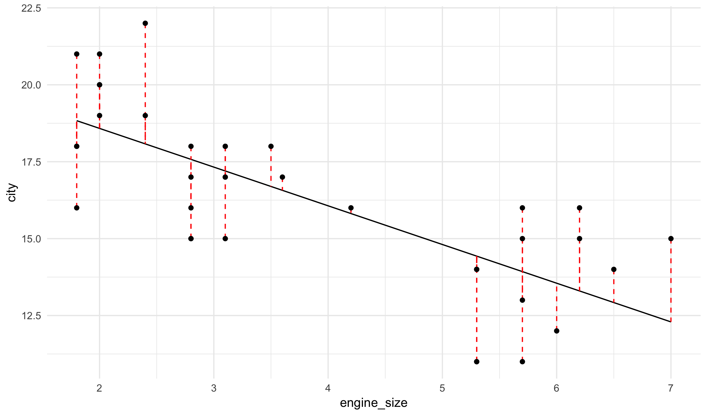
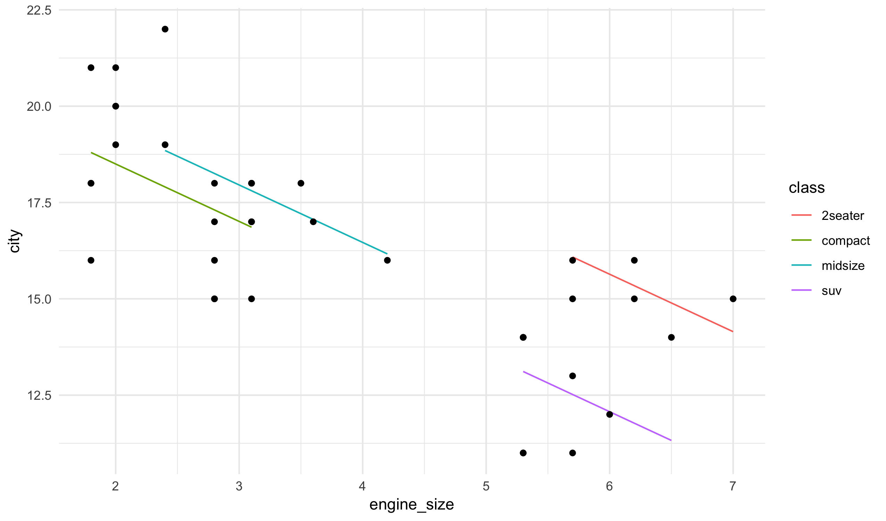

### Learning Objectives

- Understand the role of nuisance variables in hypothesis testing and why we need to control for them.
- Apply the linear regression function in the **tmodels** package to test for relationships between explanatory and response variables while controlling for nuisance variables.
- Identify and use the output of the function `tmod_linear_regression` for various types of explanatory variables.
- Interpret and summarize the values provided by a confidence interval.

## Linear regression

A linear regression model in a very common type of statistical estimator. In the simpliest
case, it is built by assuming that we can approximately model a numeric variable y as a
linear function of another numeric variably x:

$$ y_i = a + b \cdot x_i + \text{noise}_i  $$

The noise term just captures the fact that the model is not perfect and we make errors in trying
to write the y variable as a linear function from the x variable.

Using the cars dataset again, let's see a visual description of how city fuel efficency
is effected by the size of a car's engine (we will cover how to actually make these plots
after the second exam) and how we can model this relationship using a line:

The solid black line shows the regression line and the red dashed vertical lines show the noise
values.

We can run an hypothesis test that uses the following null and alternative hypotheses using the
**tmodels** package.

$$ H_0: \text{the slope of the line is zero} $$

$$ H_A: \text{the slope of the line is zero} $$

The way to do this should not come as a surprise to you at this point:


tmod_linear_regression(city ~ engine_size, data = cars)



## 
## Linear regression; T-Test
## 
## 	H0: Change in conditional mean is zero
## 	HA: Change in conditional mean is non-zero
## 
## 	Test statistic: t = -6.6659
## 	P-value: 1.035e-07
## 
## 	Parameter: change in city for unit change in engine_size
## 	            controlling for -- 
## 	Point estimate: -1.2579
## 	Confidence interval: [-1.64100, -0.87483]


The point estimate here is the point estimate for the term b (the slope) in the regression model.

Why is linear regression useful from an hypothesis testing standpoint? More specifically, we
have two continuous variables, what is the difference between this and the correlation tests?
Let's compare the output of using Pearson's product-moment correlation test:


tmod_pearson_correlation_test(city ~ engine_size, data = cars)



## 
## Pearson's product-moment correlation test
## 
## 	H0: True correlation is zero
## 	HA: True correlation is non-zero
## 
## 	Test statistic: t(35) = -6.6659
## 	P-value: 1.035e-07
## 
## 	Parameter: (Pearson) correlation coefficient
## 	Point estimate: -0.74792
## 	Confidence interval: [-0.86284, -0.55949]


The point estimate is completely different (it is trying to find the correlation not a slope),
but look at the test statistic and p-value. They are exactly the same as the ones given by 
linear regression!

This is no fluke. The linear regression hypothesis test and Pearson's
product-moment correlation test are exactly equivalent. They provide different point estimates,
but test the exact same hypotheses in exactly the same way. From a statistical inference
perspective, there is not different between the two. So why then, do we need to concern ourselves
with linear regression?

## Controlling for Nuisance Variables

All of the hypothesis tests that we have so far studied have exactly
two variables: an explanatory variable (IV) and the response variable (DV).
Our tests have null hypotheses that indicate, in various ways,
that there is no relationship between the two variables. We want to see if
there is evidence to support having an actual effect between the two variables.

Linear regression provides a nice way to extend hypothesis testing to account
for other variables that
we believe may effect the response variable and that we want to *factor out*
or *control for* in the analysis. For example, returning very briefly to the
pea plants and colored light experiment. We assumed that the plants were all
identical; what if instead some where snow peas (*saccharatum*) and others
were snap peas (*macrocarpon*). One way to deal with this is to include the
variety of the pea plant as a third variable into the model. The variety variable
as used here is what we call a **nuisance variable**.

Specifically, we can write down a multivariate linear regression with a response
variable y, independent variable x, and nusiance variable z as:

$$ y_i = a + b \cdot x_i + c \cdot z_i + \text{noise}_i  $$

Here, we are accounting for the variable z and isolating the effect of x in the 
slope term b. To run this in R, we require only a slight modification of the code
we have used for the other hypothesis tests. Simply add (with the plus sign) the
nusiance variable(s) as additional factors to the model:


tmod_linear_regression(city ~ engine_size + highway, data = cars)



## 
## Linear regression; T-Test
## 
## 	H0: Change in conditional mean is zero
## 	HA: Change in conditional mean is non-zero
## 
## 	Test statistic: t = -2.22
## 	P-value: 0.03319
## 
## 	Parameter: change in city for unit change in engine_size
## 	            controlling for -- highway
## 	Point estimate: -0.3299
## 	Confidence interval: [-0.631890, -0.027908]


The hypothesis tests here are:

$$ H_0: \text{the slope b is zero} $$

$$ H_A: \text{the slope b is not zero} $$

The point estimate here is an estimate of the parameter b. The output even tells us
explictily what we are controlling for (here, the highway fuel efficency). The p-value
says that, even controlling for the highway fuel efficency, there is a
significant relationship between engine size and city fuel efficency.

Note: We select the independent variable of interest by putting it first (after
the tilda) in the formula.

## Linear regression with categorical variables

It is possible to also include categorical variables as terms in a linear
regression. R will handle categorical nusiance variables without any
change to the input or output. Here we control for the class of the car in
the cars regression model:


tmod_linear_regression(city ~ engine_size + highway + class, data = cars)



## 
## Linear regression; T-Test
## 
## 	H0: Change in conditional mean is zero
## 	HA: Change in conditional mean is non-zero
## 
## 	Test statistic: t = -1.0751
## 	P-value: 0.2906
## 
## 	Parameter: change in city for unit change in engine_size
## 	            controlling for -- highway; class
## 	Point estimate: -0.37451
## 	Confidence interval: [-1.08500,  0.33596]


The model opperates by allowing each class of car to have its own intercept
term. Visually, it looks something like this:

Finally, we can also have a categorical variable be the independent
variable of the regression model. If there are only two categories,
this will give an analog to the two-sample t-test. If there are multiple
categories, it does a test similar to one-way ANOVA:


tmod_linear_regression(city ~ class + highway, data = cars)



## 
## Linear regression; F-Test
## 
## 	H0: Difference in conditional mean is zero
## 	HA: Difference in true means is non-zero
## 
## 	Test statistic: F(1, 3) = 4.6126
## 	P-value: 0.008595


As with one-way ANOVA, we have a p-value but there is no consistent way
to provide the analog of a point estimate.

## Confidence Intervals

We have seen that a number of hypothesis tests return an object called
a confidence interval. A p% confidence interval provides a range of
guesses for a point estimate based on a dataset that will "capture the
true parameter with probably p%". All of the intervals in the **tmodels**
package provide 95% confidence intervals.

We say that we are *95% percent confident* that the true population
parameter lies somewhere in the confidence interval.

## Assumptions of linear regression models

The linear regression model assumes the two standard assumptions we have across
all of our models: uniform sampling and independent response values. There are
additionally a host of other assumptions that all well beyond the scope of this
course. Just know that as long as you (approximately) have the two basic
assumptions, you are usually safe using linear regression for testing the
relationship between a continuous response and any explanatory variable.

A linear regression model is able to control for some nusiance variables, but
can never control for all variables that might effect a response. Therefore,
it can help more strongly *suggest* causal claims from observational data.
However, it can never replace the strong causal proof provided by a randomized
experimental design.

Note that there is no simple non-parametric version of linear regression. In
order for the core ideas of linear regression to work, we need to make strong
assupmtions about how the response data values y are generated. This makes
non-parametric tests difficult to extend in a consistant way that mirrors the
other univariate tests we have seen.

## Regression table

The output of the function `tmod_linear_regression` only tells us about the
parameter b (the slope of the independent variable of interest). Sometimes
it is useful to see estimates and information for all of the parameters.

The function `tmod_lin_reg_table` provides this information:


tmod_lin_reg_table(city ~ highway + engine_size, data = cars)



##             Estimate CI Low CI High Pr(>|t|)
## (Intercept)    5.880  2.280  9.4900 2.19e-03
## highway        0.483  0.372  0.5940 2.40e-10
## engine_size   -0.330 -0.632 -0.0279 3.32e-02


When, there is a categorical variable, you'll see a number of terms
for each of the intercepts:


tmod_lin_reg_table(city ~ highway + class, data = cars)



##              Estimate  CI Low CI High Pr(>|t|)
## (Intercept)    -2.430 -6.6400   1.780 2.49e-01
## highway         0.719  0.5530   0.885 4.42e-10
## classcompact    1.000 -0.0815   2.080 6.88e-02
## classmidsize    1.310  0.1540   2.460 2.75e-02
## classsuv        2.790  1.1100   4.480 1.96e-03


