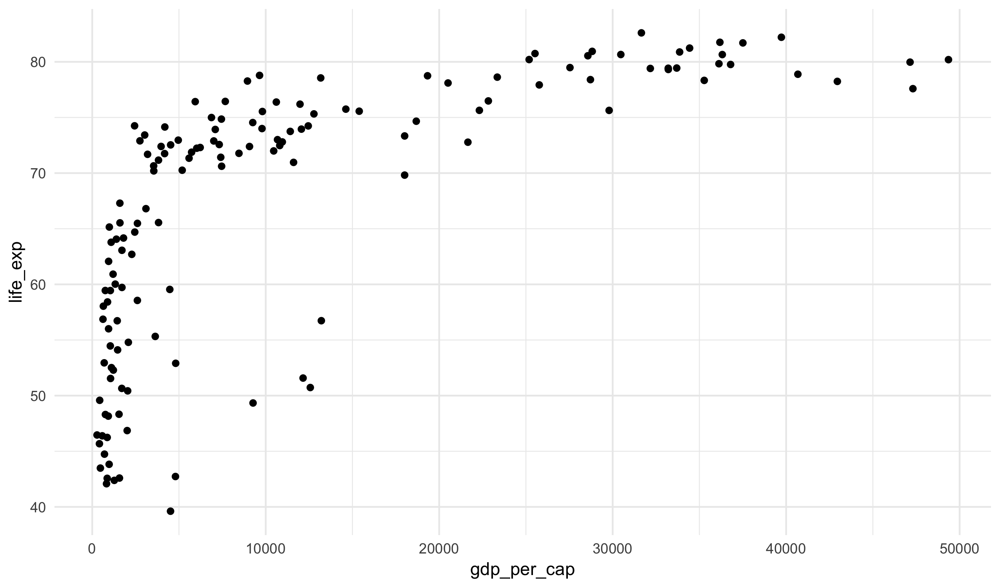
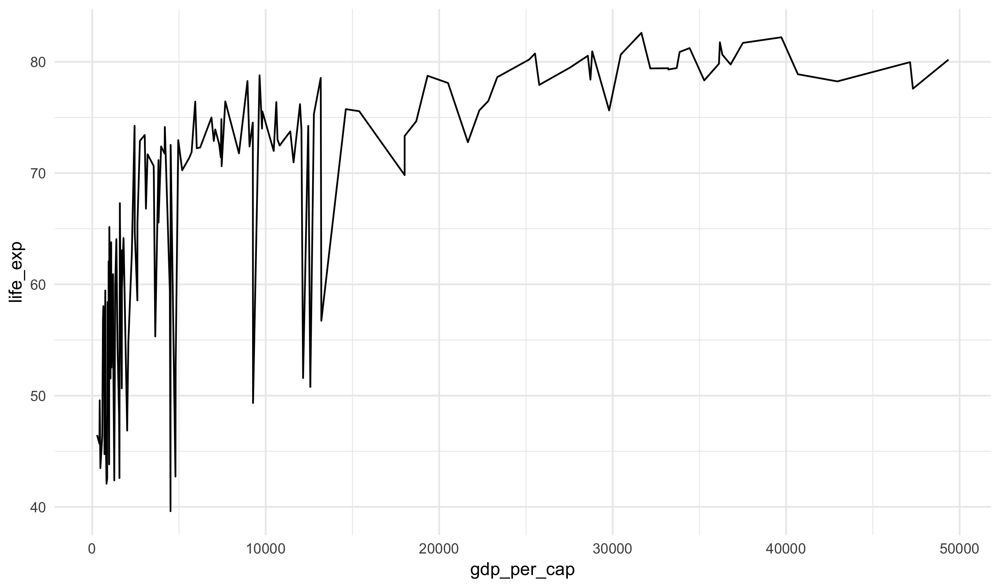
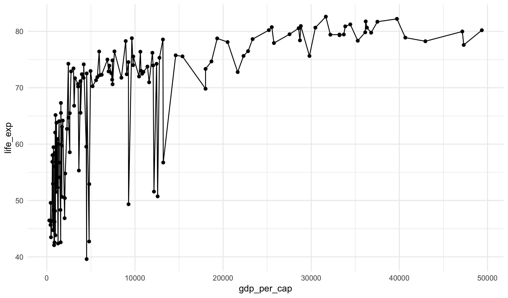
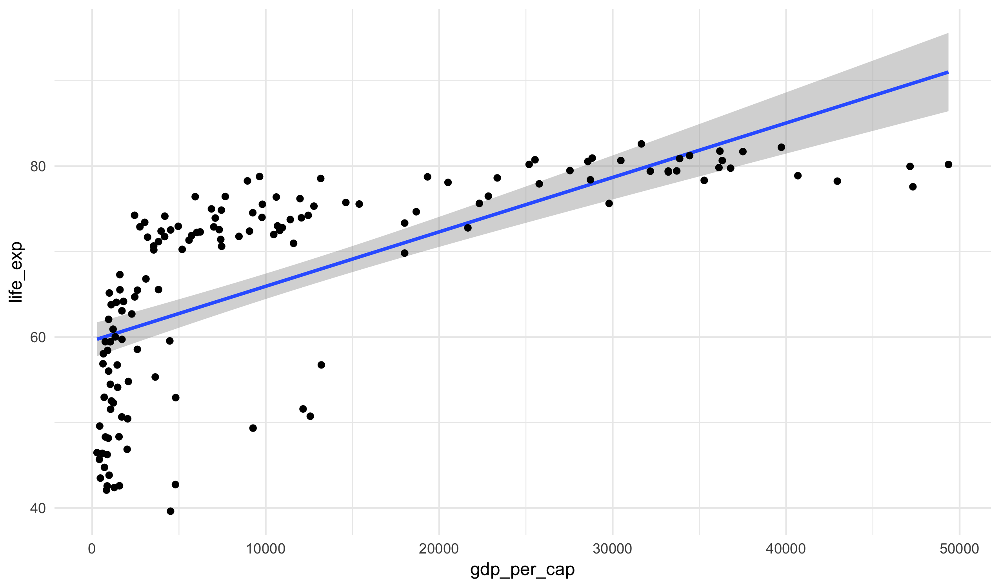
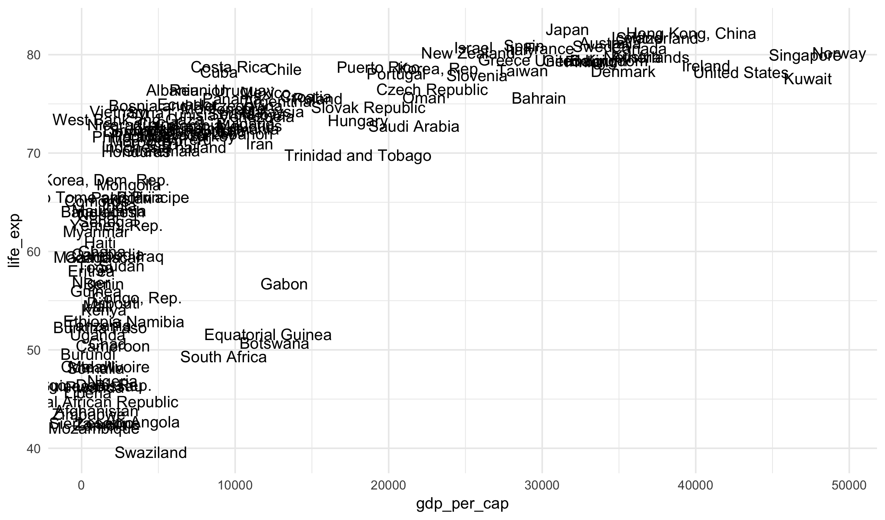
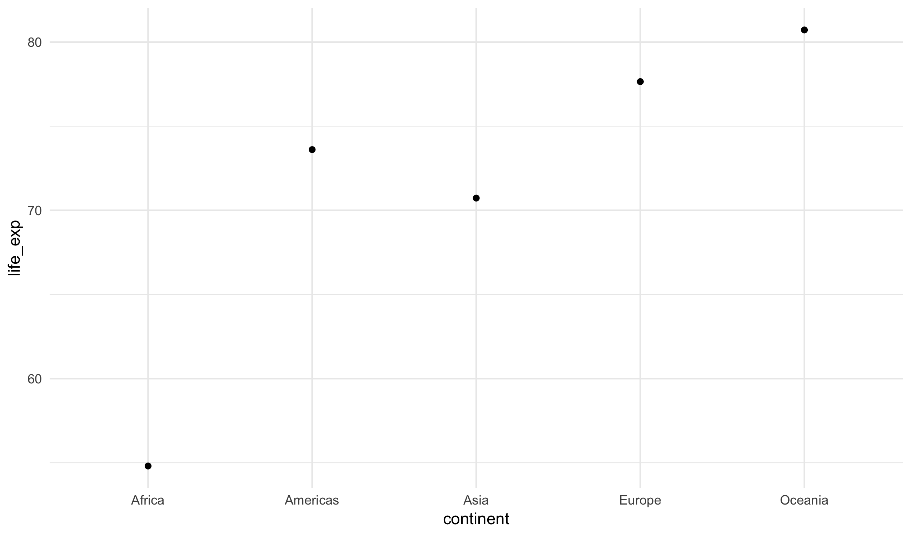
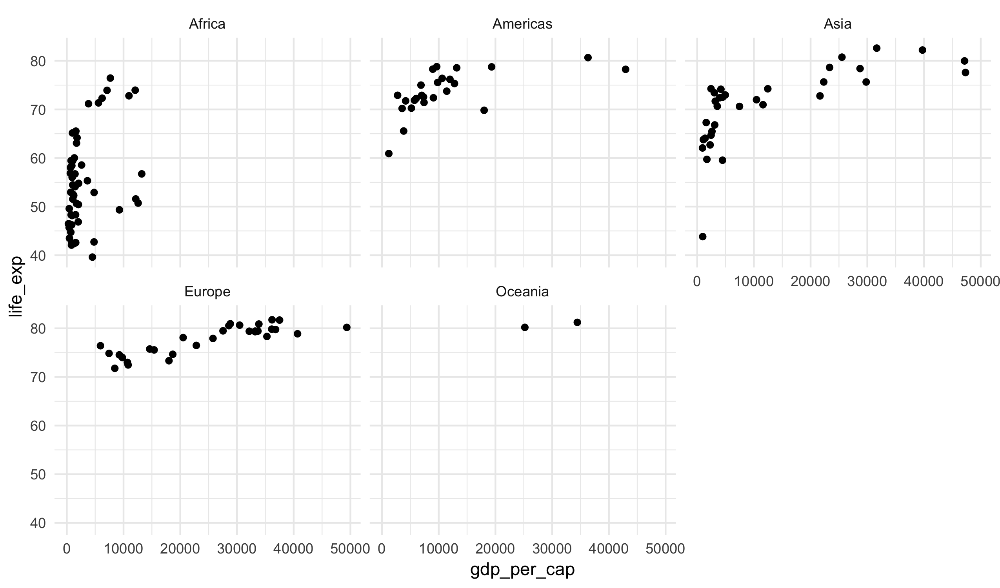
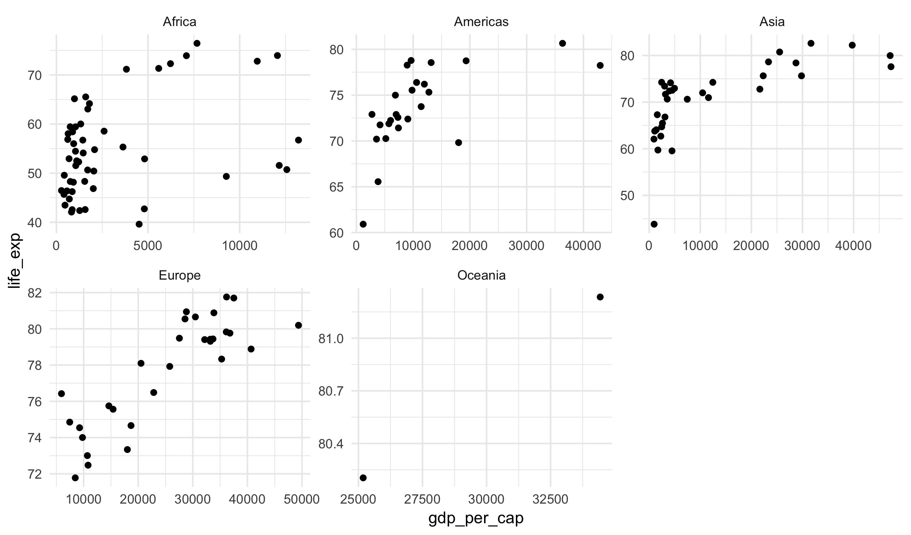

## Learning Objectives

- Identify elements composing a statistical visualization in the language of the
Grammar of Graphics
- Apply Grammar of Graphics to construct scatter plots, line plots, add
best fit lines, and group averages
- **Memorize** the syntax for constructing a scatter plot using **ggplot2**
- Use facets to break a plot up by a categorical variable

## Grammar of Graphics

As you have seen in examples already, we will be using the **ggplot2** package
for graphics in this course. The `gg` standards for the Grammar of Graphics,
an influential theoretical structure for constructing statistical graphics
created by Leland Wilkinson:

To build a statistical graphic, we will be building different layers that fit
together to produce plots. Each layer requires three elements:

- a geometry describing what type of layer is being added; for example, this
might be a point, line, or text geometry
- a dataset from which to build the layer
- a mapping from variables in the dataset into elements called aesthetics that
control the way the plot looks

## Example with Hans Roslin's data

To illustrate these points, let's look at a subset of the data that Hans
Roslin used in the video I showed on the first day of class. It contains just
a single year of the data (2007).


gapminder_2007 <- read_csv("https://statsmaths.github.io/stat_data/gapminder_2007.csv")
gapminder_2007



## # A tibble: 142 x 5
##    country     continent life_exp       pop gdp_per_cap
##    <chr>       <chr>        <dbl>     <dbl>       <dbl>
##  1 Afghanistan Asia          43.8  31889923        975.
##  2 Albania     Europe        76.4   3600523       5937.
##  3 Algeria     Africa        72.3  33333216       6223.
##  4 Angola      Africa        42.7  12420476       4797.
##  5 Argentina   Americas      75.3  40301927      12779.
##  6 Australia   Oceania       81.2  20434176      34435.
##  7 Austria     Europe        79.8   8199783      36126.
##  8 Bahrain     Asia          75.6    708573      29796.
##  9 Bangladesh  Asia          64.1 150448339       1391.
## 10 Belgium     Europe        79.4  10392226      33693.
## # … with 132 more rows


Here is a plot similar to the one that Roslin used without all of the fancy
colors and moving elements.


ggplot(gapminder_2007, aes(gdp_per_cap, life_exp)) +
  geom_point()


Here there are four specific elements that we had to choose to create the plot:

1. selecting the dataset name to use, `gapminder_2007`
2. selecting the variable `gdp_per_cap` to appear on the x-axis
3. selecting the variable `life_exp` to appear on the y-axis
4. choosing to represent the dataset with points by using the `geom_point` layer.

The specific syntax of how to put these elements together is just something that
you need to learn and memorize. Note that the plus sign goes at the end of the
first line and the second line is indented by two spaces.

## Layers

The beauty of the grammar of graphics is that we can construct many types of
plots by combining together simple layers. There is another geometry called
`geom_line` that draws a line between data observations instead of points
(note: this does not actually make much sense here, but we will try it just
to illustrate the idea):


ggplot(gapminder_2007, aes(gdp_per_cap, life_exp)) +
  geom_line()


But let's say we want the points **and** the lines, how does that work? Well, we just
add the two layers together:


ggplot(gapminder_2007, aes(gdp_per_cap, life_exp)) +
  geom_line() +
  geom_point()


Or, we could add a "best fit line" through the data using the `geom_bestfit` layer:


ggplot(gapminder_2007, aes(gdp_per_cap, life_exp)) +
  geom_bestfit() +
  geom_point()


We will cover these types of modeling lines in more detail in the third section of the
course.

## Other geometry types

The `geom_text` is another layer type that puts a label in place of a point. It requires
a new input called the `label` that describes which variable is used for the text. Here we
see it combined with the points layer:


ggplot(gapminder_2007, aes(gdp_per_cap, life_exp)) +
  geom_text(aes(label = country))


Again, the specific syntax is something you just need to look up or memorize.

We can also have the plot compute summary statistics, such as the mean, for groups in
a dataset. Here we see the mean life expectancy for each continent:


ggplot(gapminder_2007, aes(continent, life_exp)) +
  geom_mean()


## Facets

A special layer type within the **ggplot2** framework, facets allow us
to produce many small plots for each value of a character variable. It
can be added onto almost any other plot.


ggplot(gapminder_2007, aes(gdp_per_cap, life_exp)) +
  geom_point() +
  facet_wrap(~continent)


Notice that the scales of the axes are all the same. Sometimes this is
useful, but in other cases it is useful to allow these to change. We
can do this by adding the option `scales="free"`:


ggplot(gapminder_2007, aes(gdp_per_cap, life_exp)) +
  geom_point() +
  facet_wrap(~continent, scales = "free")


There are also options `scales="free_x"` and `scales="free_y"` if you
would like to only allow one axis to change.

