## Learning Objectives

- Map variables to graphic aesthetics to control elements such as color, shape,
and size.
- Apply scales to modify the colors and plot ranges of a visualization

## Data Aesthetics

Let's again look at a subset of the data that Hans Roslin used in the video I showed on
the first day of class.


gapminder_2007 <- read_csv("https://statsmaths.github.io/stat_data/gapminder_2007.csv")
gapminder_2007



## # A tibble: 142 x 5
##    country     continent life_exp       pop gdp_per_cap
##    <chr>       <chr>        <dbl>     <dbl>       <dbl>
##  1 Afghanistan Asia          43.8  31889923        975.
##  2 Albania     Europe        76.4   3600523       5937.
##  3 Algeria     Africa        72.3  33333216       6223.
##  4 Angola      Africa        42.7  12420476       4797.
##  5 Argentina   Americas      75.3  40301927      12779.
##  6 Australia   Oceania       81.2  20434176      34435.
##  7 Austria     Europe        79.8   8199783      36126.
##  8 Bahrain     Asia          75.6    708573      29796.
##  9 Bangladesh  Asia          64.1 150448339       1391.
## 10 Belgium     Europe        79.4  10392226      33693.
## # … with 132 more rows


Last time we saw how to make plots using the grammar of graphics, such as this
scatter plot:


ggplot(gapminder_2007, aes(gdp_per_cap, life_exp)) +
  geom_point()


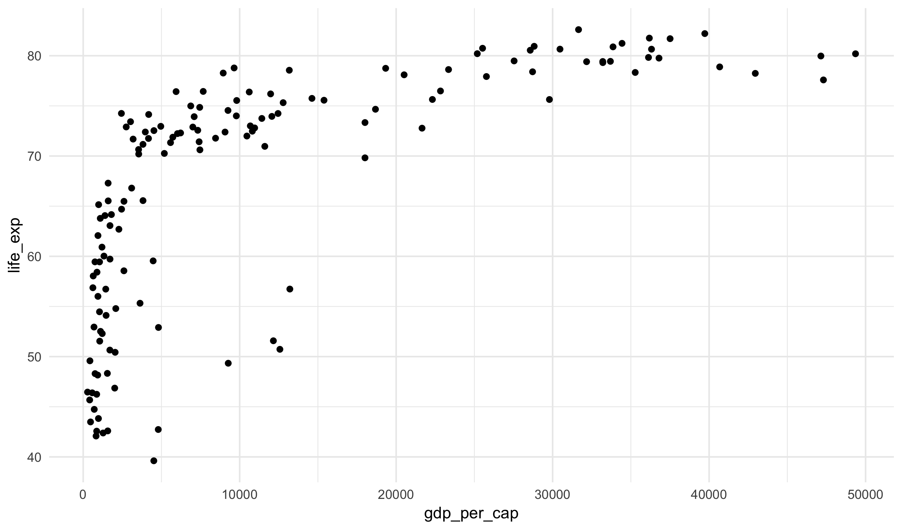

We discussed how in the first line the variable `gdp_per_cap` is mapped to the x-axis
and `life_exp` is mapped to the y-axis. One powerful feature of the grammar of graphics
is the ability to map variables into other graphical parameters. These are called
"aesthetics" (that is what the `aes()` function stands for) and we already saw one example
last time with the `geom_text` function.

For example, we can change the color of the points to correspond to a variable in the
dataset like this:


ggplot(gapminder_2007, aes(gdp_per_cap, life_exp)) +
  geom_point(aes(color = continent))


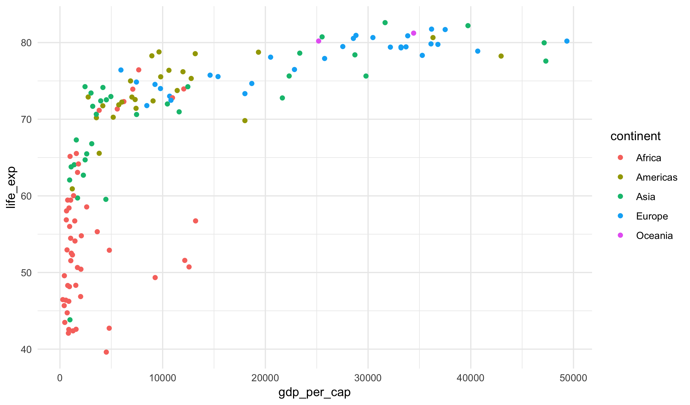

We can also map a continuous variable to color, though the default scale
is not very nice (more on this in a moment).


ggplot(gapminder_2007, aes(gdp_per_cap, life_exp)) +
  geom_point(aes(color = log(pop)))


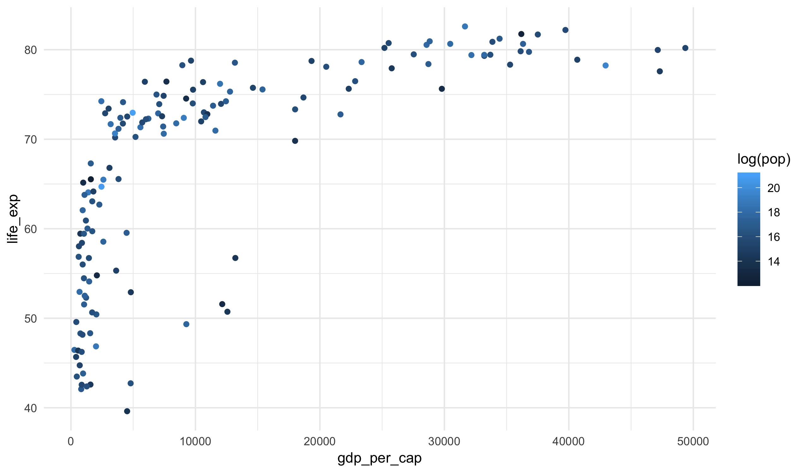

We could also change the size of the point to match the population. Note that R
writes the population key in scientific notation (2.5e+08 is the same as 2.5 time
10 to the power of eight).


ggplot(gapminder_2007, aes(gdp_per_cap, life_exp)) +
  geom_point(aes(size = pop))


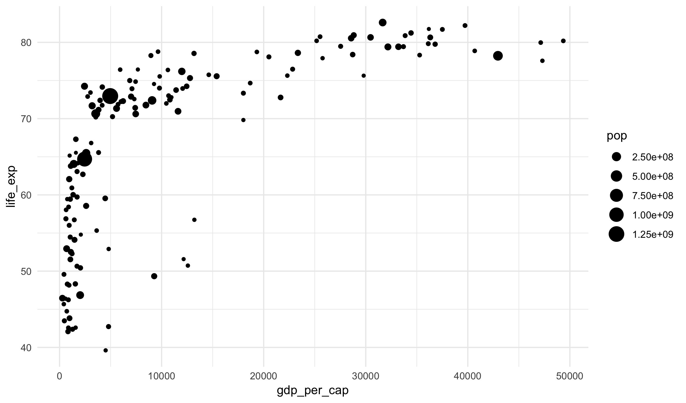

Or, finally, we could change both the size and color.


ggplot(gapminder_2007, aes(gdp_per_cap, life_exp)) +
  geom_point(aes(size = pop, color = continent))


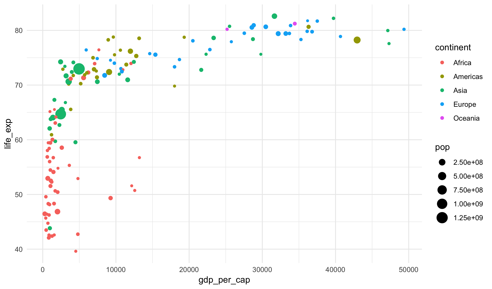

Notice that R takes care of the specific colors and sizes. All we do is indicate which
variables are mapped to a given value.

I rarely do this in practice, but it is also  possible to map a variable to a shape:


ggplot(gapminder_2007, aes(gdp_per_cap, life_exp)) +
  geom_point(aes(shape = continent))


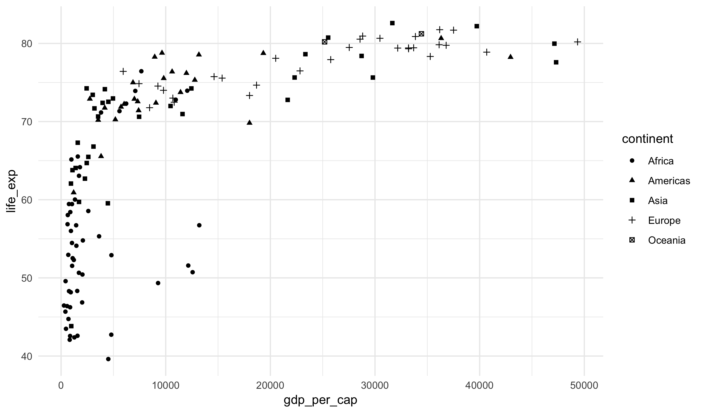

## Fixed aesthetics

A very powerful feature of the grammar of graphics is the ability to map a variable to
a visual aesthetic such as the x- and y-axes or the color and shape. In some cases,
though, you may just want to change an aesthetic to a fixed value for all points.
This can be done as well by specifying the aesthetic **outside** of the `aes()`
function. For example, here I'll change all of the points to be blue:


ggplot(gapminder_2007, aes(gdp_per_cap, life_exp)) +
  geom_point(color = "blue")


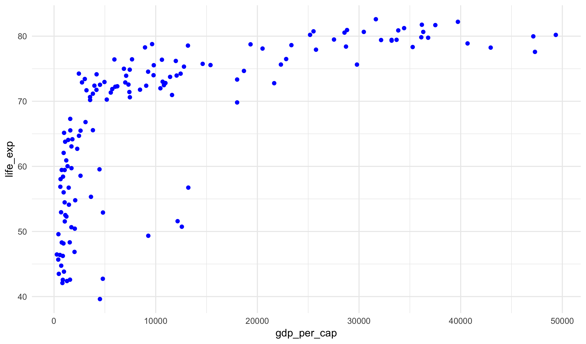

R won't give an error if I put the same code inside of the aes function. Watch
this:


ggplot(gapminder_2007, aes(gdp_per_cap, life_exp)) +
  geom_point(aes(color = "blue"))


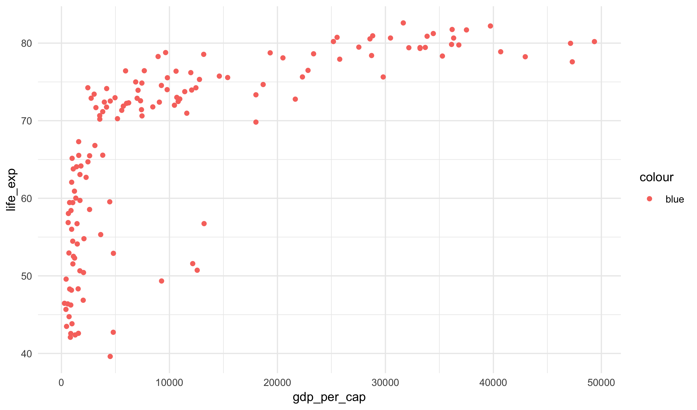

What's happening here?!

You can mix fixed and variable aesthetics in the same plot. For example, here I
use color to represent the continent but make all the points larger.


ggplot(gapminder_2007, aes(gdp_per_cap, life_exp)) +
  geom_point(aes(color = continent), size = 3)


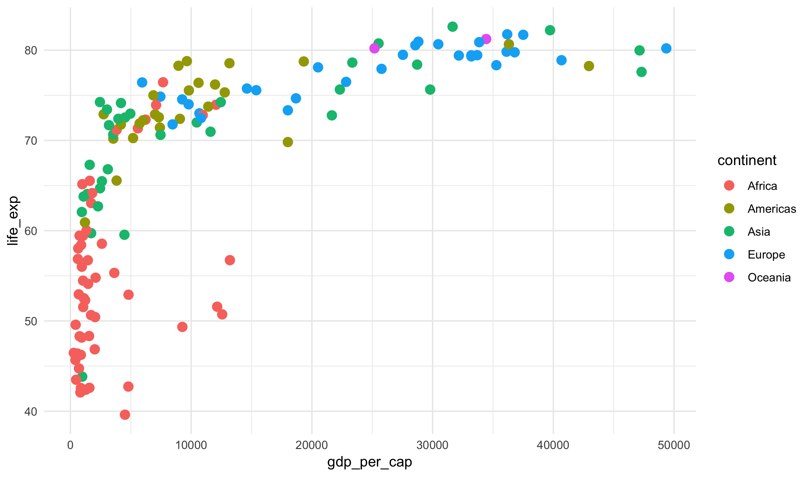

Note that the `aes()` part **must** go first. Just another rule you need to remember.

## More plot types

There are some plot types that do not have a specified y-axis. In these cases the
y-axis is determine by an internal model created by the plot. Two types that we
will frequently see are `geom_bar` for showing counts of a categorical variable:


ggplot(gapminder_2007, aes(continent)) +
  geom_bar()


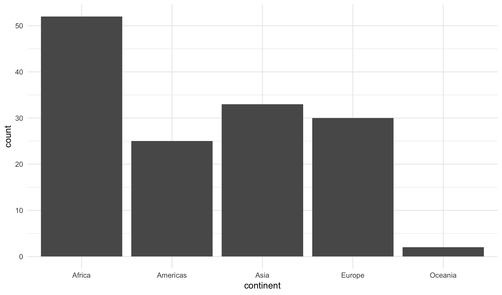

And `geom_histogram` to show the distribution of a numeric variable:


ggplot(gapminder_2007, aes(life_exp)) +
  geom_histogram(color = "black", fill = "white")



## `stat_bin()` using `bins = 30`. Pick better value with `binwidth`.


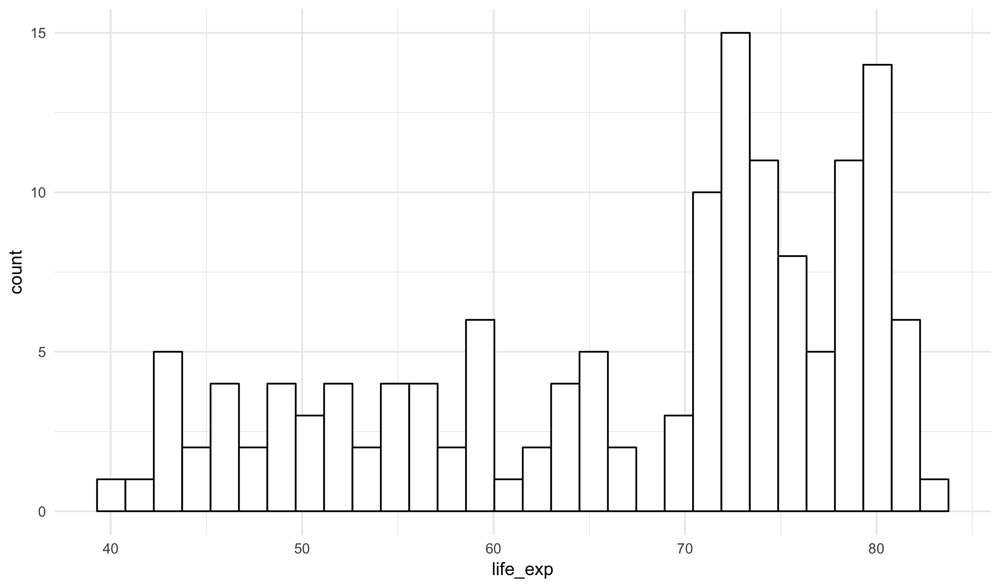

Notice that I changed two fixed aesthetics in this second plot (I like my choices
better than the default).

As a common trick with bar plots, I often add the layer `coord_flip` to make the
bars go left-to-right.


ggplot(gapminder_2007, aes(continent)) +
  geom_bar() +
  coord_flip()


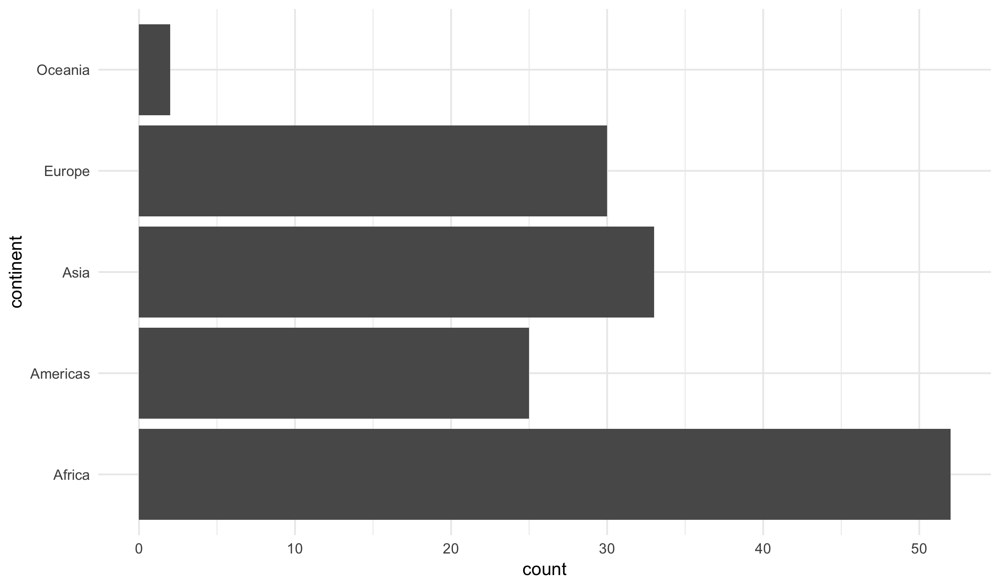

If the categories are long, this makes it easier to read them.

## Scales

We can control the exact color choosen in the plot using a layer type known as
a scale. For example, the color pallet used with the **viridis** package can be
used to change the colors choosen in a plot:


ggplot(gapminder_2007, aes(gdp_per_cap, life_exp)) +
  geom_point(aes(color = life_exp)) +
  scale_color_viridis()


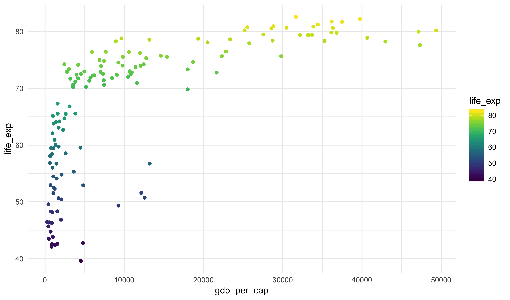

The viridis color pallet is optimized for readability for people who are color blind.
It also improves the plot when printed in black and white or projected on a badly
tuned projector.

## References

If you would like more references, here is a cheat-sheet and online notes that
extend what we have done today:

- [ggplot2 cheatsheet](https://github.com/rstudio/cheatsheets/raw/master/data-visualization-2.1.pdf)
- [R4DS: Data Viz](http://r4ds.had.co.nz/data-visualisation.html)

These cover much more than we have shown today, and you are only responsible
for the notes here. However, you may find the exercises and examples useful
if this material is new to you.

