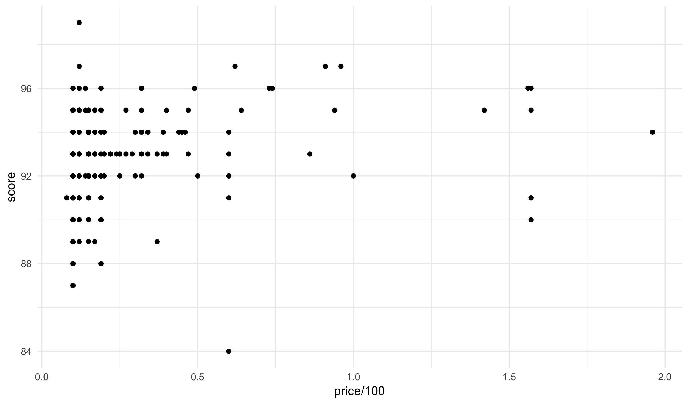
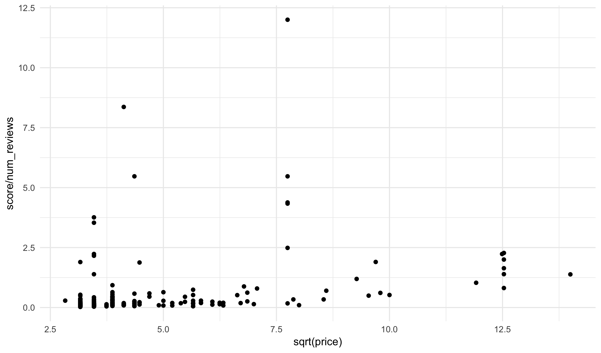
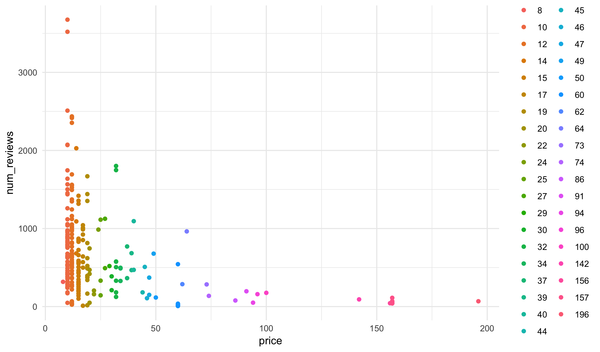
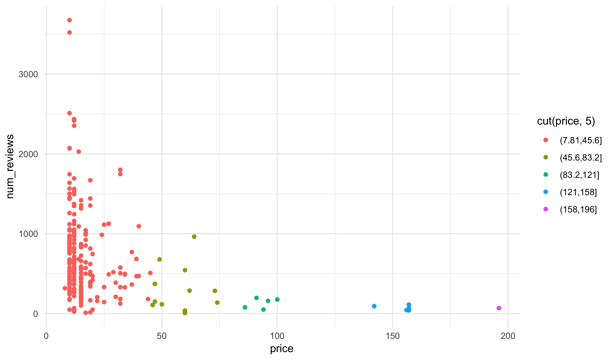
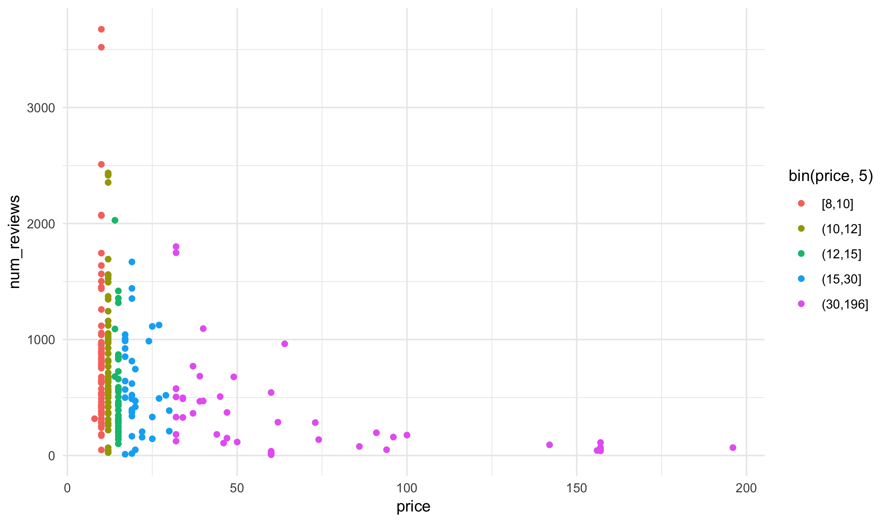
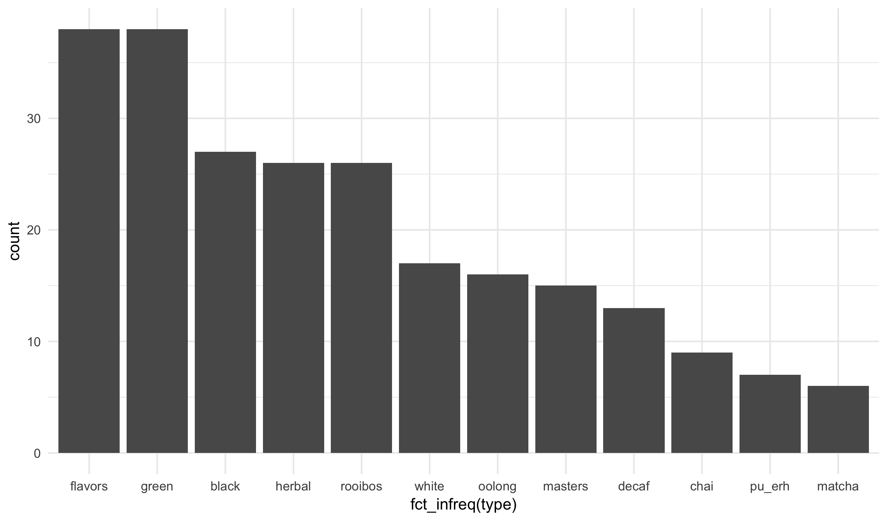
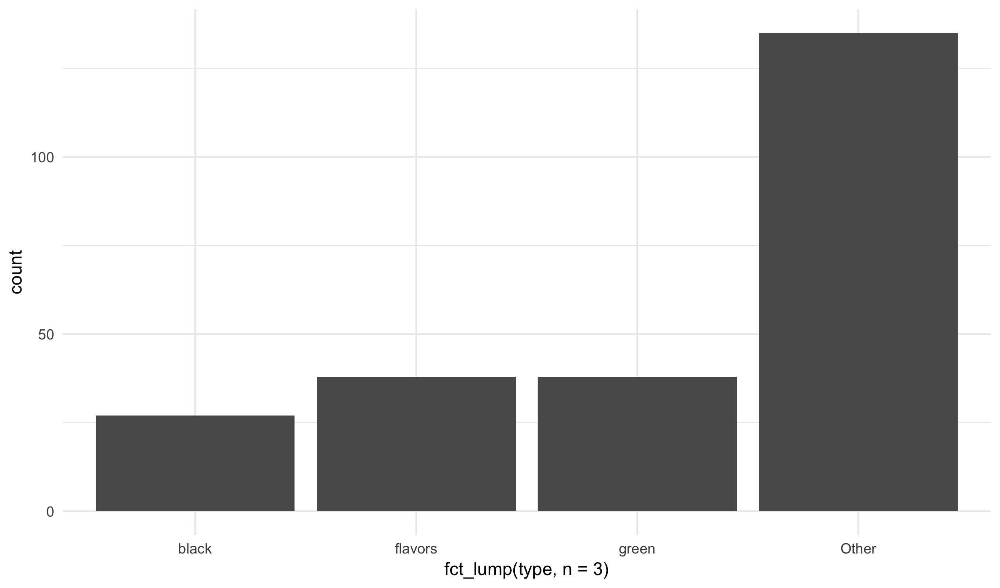
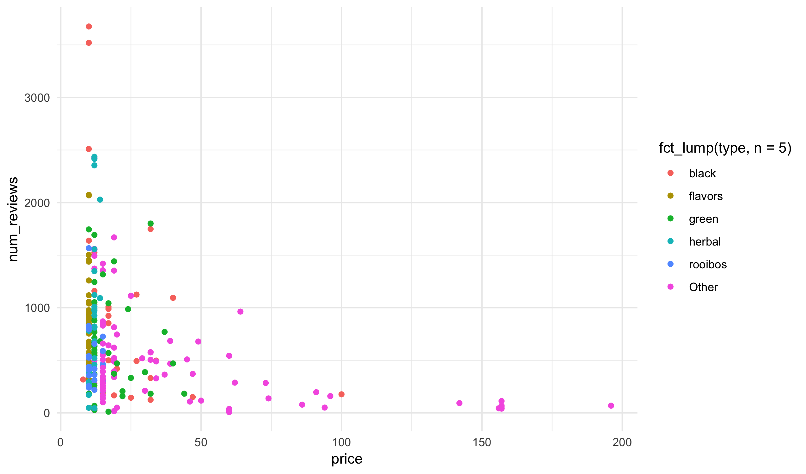

### Learning Objectives

Today we will explore how to create new variable from old variables and,
specifically, how to change the way that categorical variables are presented
in plots.

### Tea Data

For class today, let's load a dataset of teas offered by the website Adagio:


tea <- read_csv("https://statsmaths.github.io/stat_data/tea.csv")
tea



## # A tibble: 238 x 5
##    name                type  score price num_reviews
##    <chr>               <chr> <dbl> <dbl>       <dbl>
##  1 irish_breakfast     black    96    10        3675
##  2 earl_grey_bravo     black    95    10        3520
##  3 golden_monkey       black    95    27        1125
##  4 black_dragon_pearls black    96    32        1748
##  5 yunnan_noir         black    95    17         988
##  6 earl_grey_moonlight black    95    10        2510
##  7 english_breakfast   black    93    17        1008
##  8 keemun_concerto     black    92    17         499
##  9 yunnan_gold         black    95    40        1094
## 10 ceylon_sonata       black    94    12        1525
## # … with 228 more rows


### New Variables

In R, we can create new variable from old ones by apply numeric operations
or new functions. In plots, simply manipulations can be do **in-line**; that
is, we apply the functions to the variables within the plot. For example,
the tea dataset gives prices in cents. We can make a plot of price in dollars
against the score as follows:


ggplot(tea, aes(price / 100, score)) +
  geom_point()


Notice that the expression shows up verbatim in the plot. We can apply other
functions such as `sqrt` or combine two variables similarly (note: this makes
no practical sense here):


ggplot(tea, aes(sqrt(price), score / num_reviews)) +
  geom_point()


If a new variable is particularly useful or complex to construct, it may be
useful to create a new variable to store it. The syntax to do this is as
follows:


tea$price_dollars <- tea$price / 100


Notice that we need to start every variable name with `tea$`; otherwise R will
not know which dataset we are working with. In **ggplot2** commands this is
not a problem because we have already stated what the default dataset is.

### Making Numeric Data Discrete

Often in plots it will be useful to convert numeric data into categorical
data. There are three functions that I typically use to do this, depending on
the end-goal:

- `factor`: this converts each unique value of the input into its own category
- `cut`: breaks the range of the numeric variable into equal parts and combines
numbers in the same range together
- `bin`: breaks the numeric data into equally sized bins

The second two require an option named `n` that specifies the number of buckets.

Let's take a look at how this works for factor:


ggplot(tea, aes(price, num_reviews)) +
  geom_point(aes(color = factor(price)))


Cut with 5 bins:


ggplot(tea, aes(price, num_reviews)) +
  geom_point(aes(color = cut(price, 5)))


And bin with 5 bins:


library(smodels)
ggplot(tea, aes(price, num_reviews)) +
  geom_point(aes(color = bin(price, 5)))


You may find these useful, for one thing, when making maps in your second
project.

### Changing Categorical Variables

The package **forcats** provides a number of functions for changing the
way that categories are displayed. There are a number of functions, but
I find that these four are most useful:

- `fct_inorder`: order the categories in the order the categories appear
- `fct_infreq`: order the categories from the smallest to largest category
- `fct_rec`: reverse the order of the categories (useful to apply after
`fct_infreq`)
- `fct_lump`: lump together the smallest categories. Set the option `n` to
specify the number of remaining categories

We can see the effect of these most clearly on a bar plot, such as:


ggplot(tea, aes(fct_infreq(type))) +
  geom_bar()


Or


ggplot(tea, aes(fct_lump(type, n = 3))) +
  geom_bar()


They are very useful for when you want to use color but have too many small
categories:


ggplot(tea, aes(price, num_reviews)) +
  geom_point(aes(color = fct_lump(type, n = 5)))


