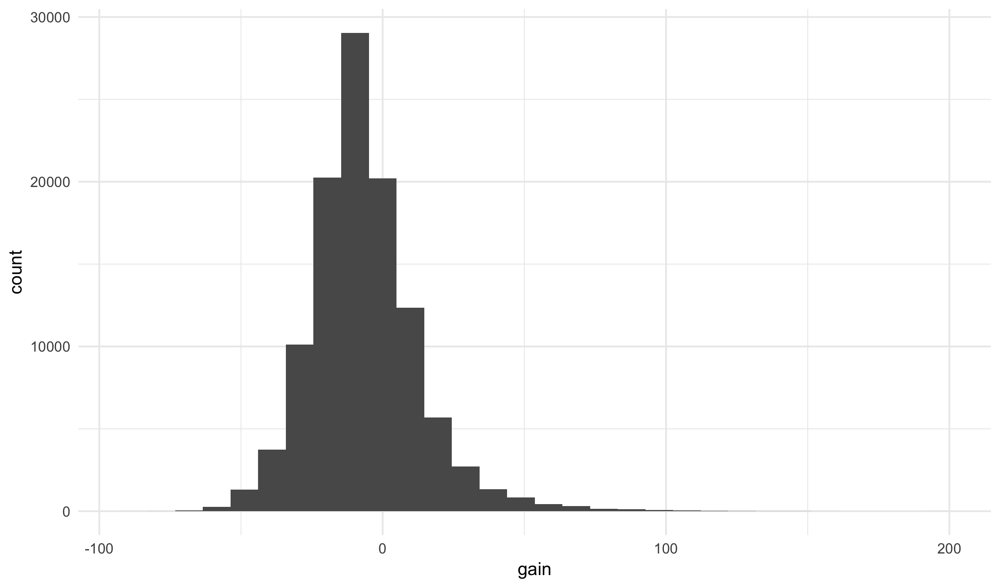

## Transforming Data

### Verbs

Today we are going to cover a set of functions that take
a data frame as an input and return a new version of the
data frame. These functions are called *verbs* and come
from the **dplyr** package. If you are familiar with
running database queries, note that all of these verbs
map onto SQL commands. In fact, R can be set up so that
**dplyr** is called over a database rather than a local
data frame in memory.

There are over 30 verbs within **dplyr**, though most are
either a minor variant or a specific application of another
verb. Today we will see just five of them, which do the
following:

- select a subset of rows from the original dataset (`filter`)
- rearrange the rows of the input (`arrange`)
- pick a subset of the variable from the original (`select`)
- create new variables (`mutate`)
- collapse rows into a single summary (`summarize`)

In the case of all verbs, the first argument is the original
data frame and the output is a new data frame. It is important
to note that **verbs do not modify the original data**; they
operate on a copy of the original data.

To illustrate these verbs we will work with a dataset of
the every commercial flight that departed from New York City
in 2013.


flights <- read_csv("https://statsmaths.github.io/stat_data/flights.csv")


### Filtering rows

The filter function takes a dataset and returns a subset of the rows
of the original data. The first argument is the dataset and the
remaining arguments are logical statements that filter the data
frame. Only rows where the statements are true will be returned.
**Yes, we've already seen this.**

Let's grab only those flights that left after 11pm (2300):


filter(flights, dep_time > 2300)



## # A tibble: 2,573 x 19
##     year month   day dep_time sched_dep_time dep_delay arr_time
##    <dbl> <dbl> <dbl>    <dbl>          <dbl>     <dbl>    <dbl>
##  1  2013     1     1     2302           2200        62     2342
##  2  2013     1     1     2306           2245        21       28
##  3  2013     1     1     2307           2245        22       32
##  4  2013     1     1     2310           2255        15       24
##  5  2013     1     1     2312           2000       192       21
##  6  2013     1     1     2323           2200        83       22
##  7  2013     1     1     2326           2130       116      131
##  8  2013     1     1     2327           2250        37       32
##  9  2013     1     1     2343           1724       379      314
## 10  2013     1     1     2353           2359        -6      425
## # … with 2,563 more rows, and 12 more variables: sched_arr_time <dbl>,
## #   arr_delay <dbl>, carrier <chr>, flight <dbl>, tailnum <chr>,
## #   origin <chr>, dest <chr>, air_time <dbl>, distance <dbl>, hour <dbl>,
## #   minute <dbl>, time_hour <dttm>


### Arranging rows

Next, we will see how to reorder to rows in a data frame using the
`arrange` function. Like all verbs it takes the data frame as its
first argument. Other arguments specify which variables to sort by:


arrange(flights, dep_time)



## # A tibble: 327,346 x 19
##     year month   day dep_time sched_dep_time dep_delay arr_time
##    <dbl> <dbl> <dbl>    <dbl>          <dbl>     <dbl>    <dbl>
##  1  2013     1    13        1           2249        72      108
##  2  2013     1    31        1           2100       181      124
##  3  2013    11    13        1           2359         2      442
##  4  2013    12    16        1           2359         2      447
##  5  2013    12    20        1           2359         2      430
##  6  2013    12    26        1           2359         2      437
##  7  2013    12    30        1           2359         2      441
##  8  2013     2    11        1           2100       181      111
##  9  2013     2    24        1           2245        76      121
## 10  2013     3     8        1           2355         6      431
## # … with 327,336 more rows, and 12 more variables: sched_arr_time <dbl>,
## #   arr_delay <dbl>, carrier <chr>, flight <dbl>, tailnum <chr>,
## #   origin <chr>, dest <chr>, air_time <dbl>, distance <dbl>, hour <dbl>,
## #   minute <dbl>, time_hour <dttm>


Other variables break ties in earlier variables:


arrange(flights, dep_time, arr_time)



## # A tibble: 327,346 x 19
##     year month   day dep_time sched_dep_time dep_delay arr_time
##    <dbl> <dbl> <dbl>    <dbl>          <dbl>     <dbl>    <dbl>
##  1  2013     6    24        1           1950       251      105
##  2  2013     4    10        1           1930       271      106
##  3  2013     1    13        1           2249        72      108
##  4  2013     2    11        1           2100       181      111
##  5  2013     3    19        1           2250        71      120
##  6  2013     2    24        1           2245        76      121
##  7  2013     1    31        1           2100       181      124
##  8  2013     7    22        1           2305        56      135
##  9  2013     5    22        1           1935       266      154
## 10  2013     7     1        1           2029       212      236
## # … with 327,336 more rows, and 12 more variables: sched_arr_time <dbl>,
## #   arr_delay <dbl>, carrier <chr>, flight <dbl>, tailnum <chr>,
## #   origin <chr>, dest <chr>, air_time <dbl>, distance <dbl>, hour <dbl>,
## #   minute <dbl>, time_hour <dttm>


To sort a variable in reverse order, wrap it in the `desc` function:


arrange(flights, desc(dep_time), arr_time)



## # A tibble: 327,346 x 19
##     year month   day dep_time sched_dep_time dep_delay arr_time
##    <dbl> <dbl> <dbl>    <dbl>          <dbl>     <dbl>    <dbl>
##  1  2013     7    17     2400           2142       138       54
##  2  2013    12     9     2400           2250        70       59
##  3  2013     7    13     2400           2245        75      101
##  4  2013     6    17     2400           2145       135      102
##  5  2013     7     7     2400           1950       250      107
##  6  2013     8    10     2400           2245        75      110
##  7  2013     9    12     2400           2000       240      203
##  8  2013     7    13     2400           2155       125      225
##  9  2013     7    28     2400           2059       181      247
## 10  2013     2    11     2400           2135       145      251
## # … with 327,336 more rows, and 12 more variables: sched_arr_time <dbl>,
## #   arr_delay <dbl>, carrier <chr>, flight <dbl>, tailnum <chr>,
## #   origin <chr>, dest <chr>, air_time <dbl>, distance <dbl>, hour <dbl>,
## #   minute <dbl>, time_hour <dttm>


You can store a dataset after arranging it, but the most useful application
is to print out the results in order to look at them.

### Selecting columns

With larger datasets (or when producing reports) it is sometimes
useful to select just a subset of the columns in the original
dataset. To do this, we use the `select` function. The first input
is the data set, with other arguments being variables we want to
look at:


select(flights, dep_time, origin, dest)



## # A tibble: 327,346 x 3
##    dep_time origin dest 
##       <dbl> <chr>  <chr>
##  1      517 EWR    IAH  
##  2      533 LGA    IAH  
##  3      542 JFK    MIA  
##  4      544 JFK    BQN  
##  5      554 LGA    ATL  
##  6      554 EWR    ORD  
##  7      555 EWR    FLL  
##  8      557 LGA    IAD  
##  9      557 JFK    MCO  
## 10      558 LGA    ORD  
## # … with 327,336 more rows


I often now use this throughout our class notes so that you may
more clearly see what is going on without the variables of interest
(which tend to be on the end as we add them) being hidden.

### Adding and modifying variables

The `mutate` function creates new variable in our dataset as a
function of other variables already present in the data. The
function always add variables at the end of the dataset, so in
order to see the results we will work with a smaller subset:


flights_sml <- select(flights, year, month, day, arr_delay,
                      dep_delay, distance, air_time)


Lets calculate the average speed of the flight. The mutate function
takes the data frame as its first argument followed by named arguments
describing the new variables:


mutate(flights_sml, speed = distance / air_time * 60)



## # A tibble: 327,346 x 8
##     year month   day arr_delay dep_delay distance air_time speed
##    <dbl> <dbl> <dbl>     <dbl>     <dbl>    <dbl>    <dbl> <dbl>
##  1  2013     1     1        11         2     1400      227  370.
##  2  2013     1     1        20         4     1416      227  374.
##  3  2013     1     1        33         2     1089      160  408.
##  4  2013     1     1       -18        -1     1576      183  517.
##  5  2013     1     1       -25        -6      762      116  394.
##  6  2013     1     1        12        -4      719      150  288.
##  7  2013     1     1        19        -5     1065      158  404.
##  8  2013     1     1       -14        -3      229       53  259.
##  9  2013     1     1        -8        -3      944      140  405.
## 10  2013     1     1         8        -2      733      138  319.
## # … with 327,336 more rows


Similarly, we can figure out how much time was lost or gained
between the departure delay and arrival delay:


mutate(flights_sml, gain = arr_delay - dep_delay)



## # A tibble: 327,346 x 8
##     year month   day arr_delay dep_delay distance air_time  gain
##    <dbl> <dbl> <dbl>     <dbl>     <dbl>    <dbl>    <dbl> <dbl>
##  1  2013     1     1        11         2     1400      227     9
##  2  2013     1     1        20         4     1416      227    16
##  3  2013     1     1        33         2     1089      160    31
##  4  2013     1     1       -18        -1     1576      183   -17
##  5  2013     1     1       -25        -6      762      116   -19
##  6  2013     1     1        12        -4      719      150    16
##  7  2013     1     1        19        -5     1065      158    24
##  8  2013     1     1       -14        -3      229       53   -11
##  9  2013     1     1        -8        -3      944      140    -5
## 10  2013     1     1         8        -2      733      138    10
## # … with 327,336 more rows


Note that you can overwrite variables that already exist with mutate
as well, though in general this should be avoided.

### Summarizing data

The `summarize` function collapses a data frame into a single row
summary. We need to specify exactly what summaries are performed.
Here, we will grab the mean values for arrival and departure delays:


summarize(flights, avg_dep_delay = mean(dep_delay),
                   avg_arr_delay = mean(arr_delay))



## # A tibble: 1 x 2
##   avg_dep_delay avg_arr_delay
##           <dbl>         <dbl>
## 1          12.6          6.90


There is also a special function called `n()` that summarizes the
total number of rows:


summarize(flights, avg_dep_delay = mean(dep_delay),
                   avg_arr_delay = mean(arr_delay),
                   n = n())



## # A tibble: 1 x 3
##   avg_dep_delay avg_arr_delay      n
##           <dbl>         <dbl>  <int>
## 1          12.6          6.90 327346


Other summary functions that you might find useful:

- `min`
- `max`
- `median`
- `sd` - standard deviation
- `quantile(x, 0.25)` - generalization of median; here, a value
that is greater than 25% of the data
- `first`, `last`, `nth`

Summarizing datasets does not seem particularly useful here as
we have other ways of computing the means and counts of a dataset
without using a new function. The real power of the summary
function comes when we learn how to group datasets next class.

## Pipes

The pipe operator `%>%` is a relative newcomer within the R
ecosystem. It is incredibly useful for writing readable code
with **dplyr** and ggplot2. The pipe passes the output of
one function to the first argument of the next function. Because
`ggplot` and all of the dplyr verbs take a data frame as its
first input we can pipe together a number of operations without
saving the intermediate results.

For example, lets see the average change in delay between departure
and arrival for flights leaving from JFK:


flights %>%
  filter(origin == "JFK") %>%
  mutate(gain = arr_delay - dep_delay) %>%
  ggplot(aes(gain)) +
    geom_histogram()



## `stat_bin()` using `bins = 30`. Pick better value with `binwidth`.


We can also save the results of a long piped set of commands as
a new dataset:


flights_best_gain_jfk <- flights %>%
  filter(origin == "JFK") %>%
  mutate(gain = arr_delay - dep_delay) %>%
  filter(gain > 10) %>%
  arrange(desc(gain)) %>%
  select(year, month, day, dep_time, dest, gain)
flights_best_gain_jfk



## # A tibble: 15,696 x 6
##     year month   day dep_time dest   gain
##    <dbl> <dbl> <dbl>    <dbl> <chr> <dbl>
##  1  2013    11     1      658 LAX     196
##  2  2013     7    10     1916 SFO     161
##  3  2013     7    22     1626 CMH     150
##  4  2013     2    16     1738 CLT     146
##  5  2013     7    10     1623 SFO     146
##  6  2013     7    28     1815 BUR     146
##  7  2013     6    30     1423 BUF     144
##  8  2013     3    18     1844 SFO     143
##  9  2013     6    24     1602 AUS     141
## 10  2013     7     7     1746 IAD     141
## # … with 15,686 more rows


Notice the standard syntax of the piped commands: each line after
the first is indented and we usually pipe the data itself as the
first line. With a **ggplot2** command, subsequent rows are indented
twice.

## Resources

Here are several good resources if you want to learn more about
the **dplyr** package:

- [R for Data Science: Chapter 5](http://r4ds.had.co.nz/transform.html)
- [data transformation cheatsheet](https://github.com/rstudio/cheatsheets/raw/master/data-transformation.pdf)

Of course, you can also ask me any questions you may have!
