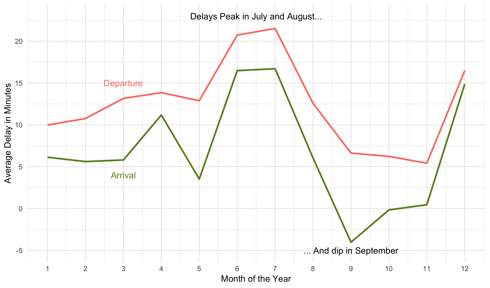
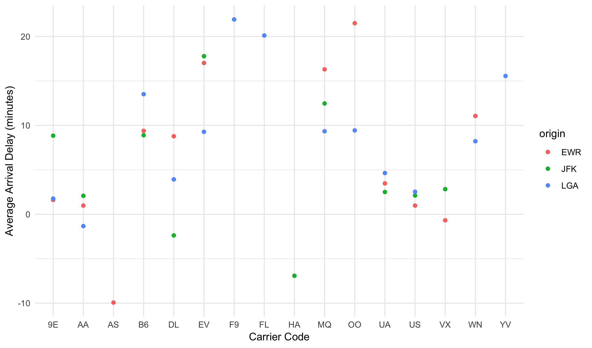

### Learning Objectives

Understand the concepts behind summarizing datasets by a grouping variable
and be able to apply this to a new dataset using the syntax in R.

### NYC Flights Data

Once again we are going to work today with the NYC Flights dataset.


flights <- read_csv("https://statsmaths.github.io/stat_data/flights.csv")



## Parsed with column specification:
## cols(
##   year = col_double(),
##   month = col_double(),
##   day = col_double(),
##   dep_time = col_double(),
##   sched_dep_time = col_double(),
##   dep_delay = col_double(),
##   arr_time = col_double(),
##   sched_arr_time = col_double(),
##   arr_delay = col_double(),
##   carrier = col_character(),
##   flight = col_double(),
##   tailnum = col_character(),
##   origin = col_character(),
##   dest = col_character(),
##   air_time = col_double(),
##   distance = col_double(),
##   hour = col_double(),
##   minute = col_double(),
##   time_hour = col_datetime(format = "")
## )



flights



## # A tibble: 327,346 x 19
##     year month   day dep_time sched_dep_time dep_delay arr_time
##    <dbl> <dbl> <dbl>    <dbl>          <dbl>     <dbl>    <dbl>
##  1  2013     1     1      517            515         2      830
##  2  2013     1     1      533            529         4      850
##  3  2013     1     1      542            540         2      923
##  4  2013     1     1      544            545        -1     1004
##  5  2013     1     1      554            600        -6      812
##  6  2013     1     1      554            558        -4      740
##  7  2013     1     1      555            600        -5      913
##  8  2013     1     1      557            600        -3      709
##  9  2013     1     1      557            600        -3      838
## 10  2013     1     1      558            600        -2      753
## # … with 327,336 more rows, and 12 more variables: sched_arr_time <dbl>,
## #   arr_delay <dbl>, carrier <chr>, flight <dbl>, tailnum <chr>,
## #   origin <chr>, dest <chr>, air_time <dbl>, distance <dbl>, hour <dbl>,
## #   minute <dbl>, time_hour <dttm>


Take note of the unit of observation here: each row is a flight.

### Changing the Unit of Observation

Often, it is useful to change the unit of observation within a dataset.
The most common way of doing this is to group the dataset by a combination
of variables and aggregate the numeric variables by taking sums, means, or
some other summary statistics. Some common examples include:

- aggregating individual shot attempts in soccer to summary statistics about each player
- aggregating census tract data to a county or state level
- aggregating information about individual patients to summaries about demographic groups

We have seen a few simple ways of doing this already within a plot (such as
counting occurances in a group with `geom_bar`). Today we will see how to do this
with the `group_summarize` command.

### Summarizing data

The group summarize command comes from the **smodels** package. Applying it to a
dataset with no additional options yields a new dataset with just a single line.
Variables in the new dataset summarize the numeric variables in the raw data.


flight_line <- group_summarize(flights)
flight_line



## # A tibble: 1 x 57
##   year_mean month_mean day_mean dep_time_mean sched_dep_time_…
##       <dbl>      <dbl>    <dbl>         <dbl>            <dbl>
## 1      2013       6.56     15.7         1349.            1340.
## # … with 52 more variables: dep_delay_mean <dbl>, arr_time_mean <dbl>,
## #   sched_arr_time_mean <dbl>, arr_delay_mean <dbl>, flight_mean <dbl>,
## #   air_time_mean <dbl>, distance_mean <dbl>, hour_mean <dbl>,
## #   minute_mean <dbl>, year_median <dbl>, month_median <dbl>,
## #   day_median <dbl>, dep_time_median <dbl>, sched_dep_time_median <dbl>,
## #   dep_delay_median <dbl>, arr_time_median <dbl>,
## #   sched_arr_time_median <dbl>, arr_delay_median <dbl>,
## #   flight_median <dbl>, air_time_median <dbl>, distance_median <dbl>,
## #   hour_median <dbl>, minute_median <dbl>, year_sd <dbl>, month_sd <dbl>,
## #   day_sd <dbl>, dep_time_sd <dbl>, sched_dep_time_sd <dbl>,
## #   dep_delay_sd <dbl>, arr_time_sd <dbl>, sched_arr_time_sd <dbl>,
## #   arr_delay_sd <dbl>, flight_sd <dbl>, air_time_sd <dbl>,
## #   distance_sd <dbl>, hour_sd <dbl>, minute_sd <dbl>, year_sum <dbl>,
## #   month_sum <dbl>, day_sum <dbl>, dep_time_sum <dbl>,
## #   sched_dep_time_sum <dbl>, dep_delay_sum <dbl>, arr_time_sum <dbl>,
## #   sched_arr_time_sum <dbl>, arr_delay_sum <dbl>, flight_sum <dbl>,
## #   air_time_sum <dbl>, distance_sum <dbl>, hour_sum <dbl>,
## #   minute_sum <dbl>, n <int>


Specifically, we see the following summaries for each numeric variable (the new names add a suffix
to the original variable name):

- `mean`: the average of all the observations
- `median`: if we ordered all observations from smallest to largest, the middle value
- `sd`: the standard deviation, a measurment of how much the number varies across observations (more on this after the break)
- `sum`: the sum of all the observations

There is also a variable just called `n` at the end, giving the total number of observations in
the entire dataset.

### Group Summarize

The magic of the `group_summarize` command comes from specifying other variables in function call.
If we specify a grouping variable, here I'll use `month`, the summarizing will be done *within*
each month. So, here, the new dataset has 12 rows with each row summarizing a given month:


flight_month <- group_summarize(flights, month)
print(flight_month, n = 12)



## # A tibble: 12 x 54
##    month year_mean day_mean dep_time_mean sched_dep_time_… dep_delay_mean
##    <dbl>     <dbl>    <dbl>         <dbl>            <dbl>          <dbl>
##  1     1      2013     15.8         1347.            1339.           9.99
##  2     2      2013     15.0         1348.            1340.          10.8 
##  3     3      2013     16.1         1359.            1352.          13.2 
##  4     4      2013     15.4         1353.            1345.          13.8 
##  5     5      2013     15.9         1351.            1341.          12.9 
##  6     6      2013     15.5         1350.            1336.          20.7 
##  7     7      2013     16.2         1352.            1339.          21.5 
##  8     8      2013     15.9         1350.            1342.          12.6 
##  9     9      2013     15.7         1334.            1330.           6.63
## 10    10      2013     16.0         1340.            1335.           6.23
## 11    11      2013     15.3         1345.            1342.           5.42
## 12    12      2013     15.9         1357.            1342.          16.5 
## # … with 48 more variables: arr_time_mean <dbl>,
## #   sched_arr_time_mean <dbl>, arr_delay_mean <dbl>, flight_mean <dbl>,
## #   air_time_mean <dbl>, distance_mean <dbl>, hour_mean <dbl>,
## #   minute_mean <dbl>, year_median <dbl>, day_median <dbl>,
## #   dep_time_median <dbl>, sched_dep_time_median <dbl>,
## #   dep_delay_median <dbl>, arr_time_median <dbl>,
## #   sched_arr_time_median <dbl>, arr_delay_median <dbl>,
## #   flight_median <dbl>, air_time_median <dbl>, distance_median <dbl>,
## #   hour_median <dbl>, minute_median <dbl>, year_sd <dbl>, day_sd <dbl>,
## #   dep_time_sd <dbl>, sched_dep_time_sd <dbl>, dep_delay_sd <dbl>,
## #   arr_time_sd <dbl>, sched_arr_time_sd <dbl>, arr_delay_sd <dbl>,
## #   flight_sd <dbl>, air_time_sd <dbl>, distance_sd <dbl>, hour_sd <dbl>,
## #   minute_sd <dbl>, year_sum <dbl>, day_sum <dbl>, dep_time_sum <dbl>,
## #   sched_dep_time_sum <dbl>, dep_delay_sum <dbl>, arr_time_sum <dbl>,
## #   sched_arr_time_sum <dbl>, arr_delay_sum <dbl>, flight_sum <dbl>,
## #   air_time_sum <dbl>, distance_sum <dbl>, hour_sum <dbl>,
## #   minute_sum <dbl>, n <int>


This dataset can then be used in further visualizations. Such as:


ggplot(flight_month, aes(month, dep_delay_mean)) +
  geom_line(color = "salmon", size = 1) +
  geom_line(aes(y = arr_delay_mean), color = "olivedrab", size = 1) +
  scale_x_continuous(breaks = c(1,2,3,4,5,6,7,8,9,10,11,12)) +
  annotate("text", x = 6.5, y = 23, label = "Delays Peak in July and August...") +
  annotate("text", x = 9, y = -5, label = "... And dip in September") +
  annotate("text", x = 3, y = 15, color = "salmon", label = "Departure") +
  annotate("text", x = 3, y = 4, color = "olivedrab", label = "Arrival") +
  xlab("Month of the Year") +
  ylab("Average Delay in Minutes")


Notice that it would be impossible to produce this graphic without the summarize command.

### Summarize By Multiple Variables

By supplying multiple variables to the `group_summarize` command, we can group simultaneously by both.
Here we have a unique row for each combination of carrier and departure airport:


flight_carrier <- group_summarize(flights, carrier, origin)


Which allows us to make plots like this:


ggplot(flight_carrier, aes(carrier, arr_delay_mean)) +
  geom_point(aes(color = origin)) +
  xlab("Carrier Code") +
  ylab("Average Arrival Delay (minutes)")


As you can imagine, summarizing data can quickly allow for very complex
graphics and analyses.

