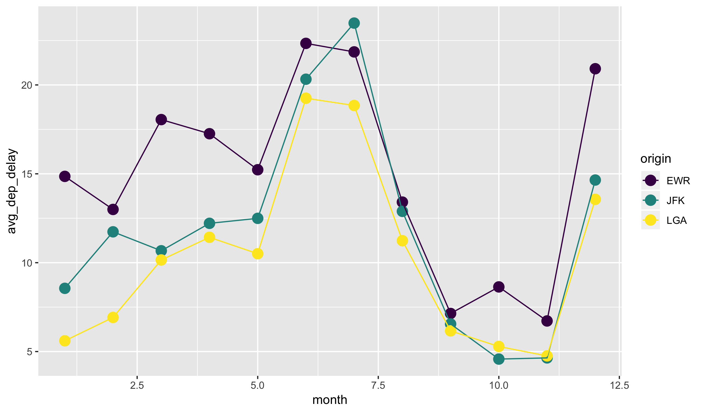
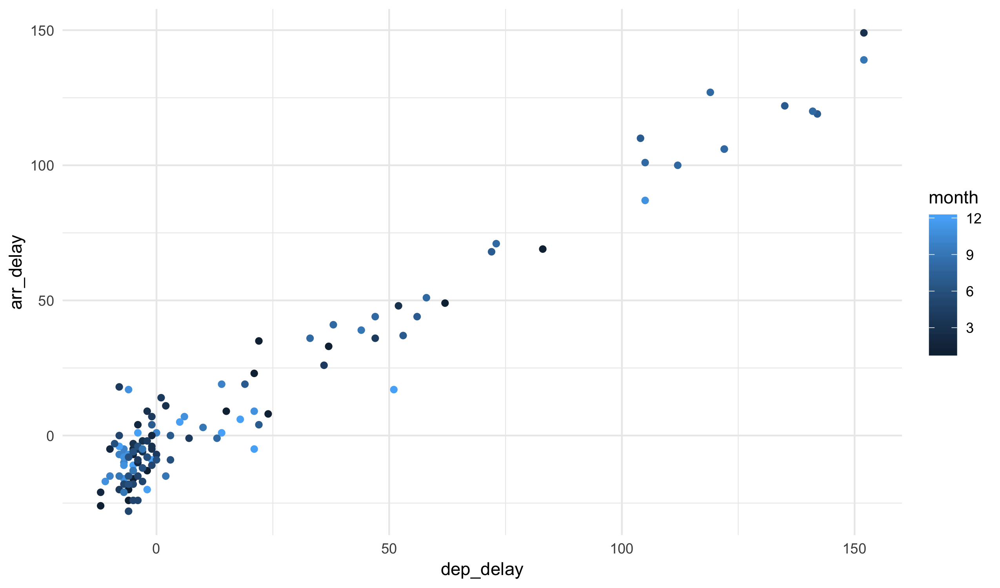


library(readr)
library(ggplot2)
library(dplyr)



## Warning: package 'dplyr' was built under R version 3.5.2



library(viridis)


# Grouping data

Today we are going to look at the NYC flights dataset once again:


flights <- read_csv("https://statsmaths.github.io/stat_data/flights.csv")


Our object of study will be the function `group_by`, a **dplyr**
verb that seemingly does nothing (or very little) to a dataset.
Here, we group the flights data by month:


group_by(flights, month)



## # A tibble: 327,346 x 19
## # Groups:   month [12]
##     year month   day dep_time sched_dep_time dep_delay arr_time
##    <dbl> <dbl> <dbl>    <dbl>          <dbl>     <dbl>    <dbl>
##  1  2013     1     1      517            515         2      830
##  2  2013     1     1      533            529         4      850
##  3  2013     1     1      542            540         2      923
##  4  2013     1     1      544            545        -1     1004
##  5  2013     1     1      554            600        -6      812
##  6  2013     1     1      554            558        -4      740
##  7  2013     1     1      555            600        -5      913
##  8  2013     1     1      557            600        -3      709
##  9  2013     1     1      557            600        -3      838
## 10  2013     1     1      558            600        -2      753
## # … with 327,336 more rows, and 12 more variables: sched_arr_time <dbl>,
## #   arr_delay <dbl>, carrier <chr>, flight <dbl>, tailnum <chr>,
## #   origin <chr>, dest <chr>, air_time <dbl>, distance <dbl>, hour <dbl>,
## #   minute <dbl>, time_hour <dttm>


Other than a note in the output, the dataset is completely unchanged.
I like to think of the `group_by` function as putting a post-it note
on the dataset saying "treat unique combinations of the grouped variables
as their own data frames". When passing the output of this function
to `summarize`, it will not return one summary row *for each group*.

For example:


flights %>%
  group_by(month) %>%
  summarize(avg_dep_delay = mean(dep_delay),
            avg_arr_delay = mean(arr_delay),
            n = n())



## # A tibble: 12 x 4
##    month avg_dep_delay avg_arr_delay     n
##    <dbl>         <dbl>         <dbl> <int>
##  1     1          9.99         6.13  26398
##  2     2         10.8          5.61  23611
##  3     3         13.2          5.81  27902
##  4     4         13.8         11.2   27564
##  5     5         12.9          3.52  28128
##  6     6         20.7         16.5   27075
##  7     7         21.5         16.7   28293
##  8     8         12.6          6.04  28756
##  9     9          6.63        -4.02  27010
## 10    10          6.23        -0.167 28618
## 11    11          5.42         0.461 26971
## 12    12         16.5         14.9   27020


We see that flights in June take off on average 20 minutes late, whereas
flights in November took off only a 5.4 minutes late.

We can group by multiple variables at once as well. Here we show the
average departure delay by airport and by month:


flights %>%
  group_by(origin, month) %>%
  summarize(avg_dep_delay = mean(dep_delay),
            avg_arr_delay = mean(arr_delay),
            n = n()) %>%
  ggplot(aes(month, avg_dep_delay)) +
    geom_point(aes(color = origin), size = 4) +
    geom_line(aes(color = origin)) +
    scale_color_viridis(discrete = TRUE)


Notice that when grouping by multiple variables the summarize
function *peels off* the outer most layer of the grouping:


flights %>%
  group_by(origin, month) %>%
  summarize(avg_dep_delay = mean(dep_delay),
            avg_arr_delay = mean(arr_delay),
            n = n())



## # A tibble: 36 x 5
## # Groups:   origin [3]
##    origin month avg_dep_delay avg_arr_delay     n
##    <chr>  <dbl>         <dbl>         <dbl> <int>
##  1 EWR        1         14.9          12.8   9616
##  2 EWR        2         13.0           8.78  8575
##  3 EWR        3         18.1          10.6  10015
##  4 EWR        4         17.3          14.1  10231
##  5 EWR        5         15.2           5.38 10303
##  6 EWR        6         22.3          16.9   9736
##  7 EWR        7         21.9          15.5  10126
##  8 EWR        8         13.4           6.71 10144
##  9 EWR        9          7.14         -4.73  9362
## 10 EWR       10          8.64          2.60 10006
## # … with 26 more rows


To remove all grouping, using the `ungroup()` function:


flights %>%
  group_by(origin, month) %>%
  summarize(avg_dep_delay = mean(dep_delay),
            avg_arr_delay = mean(arr_delay),
            n = n()) %>%
  ungroup()



## # A tibble: 36 x 5
##    origin month avg_dep_delay avg_arr_delay     n
##    <chr>  <dbl>         <dbl>         <dbl> <int>
##  1 EWR        1         14.9          12.8   9616
##  2 EWR        2         13.0           8.78  8575
##  3 EWR        3         18.1          10.6  10015
##  4 EWR        4         17.3          14.1  10231
##  5 EWR        5         15.2           5.38 10303
##  6 EWR        6         22.3          16.9   9736
##  7 EWR        7         21.9          15.5  10126
##  8 EWR        8         13.4           6.71 10144
##  9 EWR        9          7.14         -4.73  9362
## 10 EWR       10          8.64          2.60 10006
## # … with 26 more rows


It is also possible to use grouped data with `mutate` and
`filter`. For example, here we return the 3 latest flights
for each day in the dataset:


flights %>%
  group_by(year, month, day) %>%
  filter(rank(desc(arr_delay)) <= 3) %>%
  select(year, month, day, arr_delay)



## # A tibble: 1,085 x 4
## # Groups:   year, month, day [365]
##     year month   day arr_delay
##    <dbl> <dbl> <dbl>     <dbl>
##  1  2013     1     1       851
##  2  2013     1     1       338
##  3  2013     1     1       456
##  4  2013     1     2       323
##  5  2013     1     2       368
##  6  2013     1     2       359
##  7  2013     1     3       270
##  8  2013     1     3       257
##  9  2013     1     3       285
## 10  2013     1     4       162
## # … with 1,075 more rows


Here, we see what proportion of the arrival delays is taken
up by each destination airport:


flights %>%
  group_by(origin, dest) %>%
  summarize(dep_delay_total = sum(dep_delay)) %>%
  mutate(dep_delay_prop = dep_delay_total / sum(dep_delay_total) * 100) %>%
  arrange(desc(dep_delay_prop))



## # A tibble: 223 x 4
## # Groups:   origin [3]
##    origin dest  dep_delay_total dep_delay_prop
##    <chr>  <chr>           <dbl>          <dbl>
##  1 LGA    ATL            114050          11.0 
##  2 LGA    ORD             90553           8.70
##  3 JFK    SFO             96032           7.32
##  4 JFK    LAX             94355           7.19
##  5 LGA    CLT             53226           5.12
##  6 JFK    BOS             66763           5.09
##  7 LGA    FLL             50516           4.86
##  8 EWR    ORD             84707           4.82
##  9 LGA    DEN             47741           4.59
## 10 LGA    MCO             46028           4.42
## # … with 213 more rows


Yes, pipes with chained together grouped mutates and summaries
can get complex very quickly! Try to keep up with the basic ideas
and the more complicated examples will begin making sense soon.

# Variable types in plots

The `factor` function turns any variable into a factor
variable; a factor is a type of object that R knows to treat as categories.
We can use the `mutate` function to make a permanent
change, or apply it inline to effect the way a plot is built.
For example, compare this:


filter(flights, day == 1, hour > 21) %>%
  ggplot(aes(dep_delay, arr_delay)) +
    geom_point(aes(color = month)) +
    theme_minimal()


And this:


filter(flights, day == 1, hour > 21) %>%
  ggplot(aes(dep_delay, arr_delay)) +
    geom_point(aes(color = factor(month))) +
    theme_minimal()


Alternatively, if a variable is truly continuous we can convert
it into a factor by using the `cut` function. This function splits
the range of the variable into evenly sized buckets and associates
each input with a specific value of the bucket. For example,
take the following example:


filter(flights, day == 1, hour > 21) %>%
  ggplot(aes(dep_delay, arr_delay)) +
    geom_point(aes(color = cut(dep_delay, 4))) +
    theme_minimal()


Of course, we would usually not color the points using the same
variable as one of the axes, but this helps illustrate what the
function is doing.

